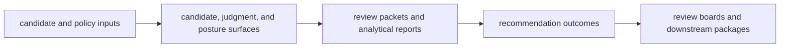

# Interfaces

`bijux-proteomics-intelligence` interfaces are how recommendation logic becomes
usable to humans and tooling. This section should help a reader see which
surfaces accept candidates and judgment inputs, which ones emit rankings,
review packets, interpretation summaries, and recommendation outcomes, and
where explanation is part of the contract instead of optional decoration.

## What These Interfaces Need To Preserve

- recommendation output must stay explainable enough for review, not just
  machine-readable enough for automation
- scoring surfaces must reveal policy shape without pretending to be evidence
  truth
- downstream consumers need stable outcome and report forms because real
  portfolio decisions depend on them

## Start With

- open [Data Contracts](https://bijux.io/bijux-proteomics/05-bijux-proteomics-intelligence/interfaces/data-contracts/)
  when the question is what a score, shortlist, brief, or outcome is allowed to
  mean
- open [Artifact Contracts](https://bijux.io/bijux-proteomics/05-bijux-proteomics-intelligence/interfaces/artifact-contracts/)
  when the real concern is report payload shape and explanation output
- open [Operator Workflows](https://bijux.io/bijux-proteomics/05-bijux-proteomics-intelligence/interfaces/operator-workflows/)
  when the reader wants to follow the decision surface in practice
- open [Compatibility Commitments](https://bijux.io/bijux-proteomics/05-bijux-proteomics-intelligence/interfaces/compatibility-commitments/)
  before changing an explanation or outcome contract that review processes may
  depend on

## Read By Consumer

- [Public Imports](https://bijux.io/bijux-proteomics/05-bijux-proteomics-intelligence/interfaces/public-imports/)
  for code-level ranking, judgment, and review entrypoints
- [Data Contracts](https://bijux.io/bijux-proteomics/05-bijux-proteomics-intelligence/interfaces/data-contracts/)
  and [Artifact Contracts](https://bijux.io/bijux-proteomics/05-bijux-proteomics-intelligence/interfaces/artifact-contracts/)
  for the stable shapes used in decision review
- [API Surface](https://bijux.io/bijux-proteomics/05-bijux-proteomics-intelligence/interfaces/api-surface/),
  [CLI Surface](https://bijux.io/bijux-proteomics/05-bijux-proteomics-intelligence/interfaces/cli-surface/),
  and [Configuration Surface](https://bijux.io/bijux-proteomics/05-bijux-proteomics-intelligence/interfaces/configuration-surface/)
  for operator and automation entrypoints
- [Entrypoints and Examples](https://bijux.io/bijux-proteomics/05-bijux-proteomics-intelligence/interfaces/entrypoints-and-examples/)
  for concrete flows that tie policy to outputs

## What This Section Should Clarify

- where recommendation interfaces end and governance interpretation begins
- which outputs are part of the stable surface versus transient implementation
  detail
- why explanation belongs in the interface contract for this package

## First Proof Check

- `src/bijux_proteomics_intelligence/candidates/`, `judgment/`, and `posture/`
- `src/bijux_proteomics_intelligence/reviews/`, `interpretation/`, and `learning/`
- `packages/bijux-proteomics-intelligence/tests`
