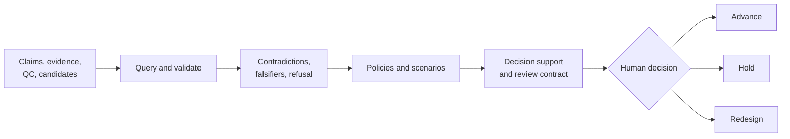

# Interfaces

Intelligence turns assembled scientific evidence into explicit questions,
rankings, challenges, scenario evaluations, recommendations, and review
artifacts. Its interface contract preserves the reasoning around a decision:
the policy applied, evidence posture, contradictions, uncertainty, refusal
conditions, escalation flags, and required human review.



## Interface families

| Family | Reads | Produces | Does not claim |
| --- | --- | --- | --- |
| `candidates` | candidate records, metrics, confidence, provenance | filtered sets, scores, Pareto frontier, selection | that a rank authorizes progression |
| `claims`, `contradictions`, `falsifiers`, `refusal` | claims and linked evidence | support status, conflicts, challenge tests, refusal reasons | that absence of a detected conflict proves truth |
| `interpretation`, `query` | analytical results and context | bounded interpretations and question answers | causal or universal biological meaning |
| `judgment`, `posture` | policies, scenarios, evidence posture | recommendations, confidence spread, escalation and hold pressure | autonomous decision authority |
| `reviews`, `belief_audit` | assembled outputs and claim lineage | review contracts, decision briefs, outsider packets, audits | that report completeness equals evidence sufficiency |
| `learning`, `next_steps` | outcomes, unresolved questions, QC failures | adaptation records and follow-up recommendations | permission to run an experiment |

## Public entry model

The package root exports 14 lazy-loaded owner modules rather than a flat list
of hundreds of symbols:

```python
from bijux_proteomics_intelligence import candidates, claims, reviews
```

Symbols are imported from the owner module:

```python
from bijux_proteomics_intelligence.claims import validate_claim_support
from bijux_proteomics_intelligence.reviews import build_intelligence_report_contract
```

Use [API surface](api-surface.md) for the owner map and output guarantees. Use
[Public imports](public-imports.md) for path choice, including the two distinct
candidate representations intentionally exposed by the `candidates` facade.

## Review-critical output

An intelligence artifact is decision-useful only when a reviewer can recover:

- the evidence and claims evaluated;
- the ranking or progression policy and its lineage;
- the assumptions, missing support, and contradictions;
- uncertainty and sensitivity across plausible scenarios;
- refusal, hold, or escalation conditions;
- the human decision boundary and next evidence request.

That information belongs in the interface, not in logs or undocumented
operator memory. See [Data contracts](data-contracts.md) for field semantics and
[Artifact contracts](artifact-contracts.md) for portable review forms.

## Authority boundary

Intelligence can recommend, challenge, refuse unsupported claims, and identify
the next discriminating check. It does not execute core analyses, rewrite
knowledge provenance, schedule runtime work, authorize candidate progression,
or approve laboratory activity. Those handoffs remain explicit so an
explainable recommendation cannot quietly become an automated decision.
