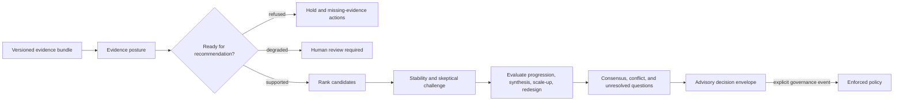

# Decision review workflow

Intelligence converts evidence into a challengeable recommendation. It does
not authorize laboratory work or runtime execution. The workflow is designed
to make a polished but weak recommendation lose to a grounded hold, refusal,
or discriminating follow-up.

## Build a reviewable recommendation

1. Freeze the candidate cohort and the exact evidence bundle. Record source
   provenance, freshness, contradictions, and decisive evidence.
2. Run `assess_recommendation_readiness()`. A blocking contradiction or thin
   grounding returns a refusal; stale or degraded evidence requires review.
3. Validate the metric catalog and factor weights, then rank candidates with a
   versioned `RankingPolicy`. Retain hard-filter rejections and reason codes.
4. Analyze ranking stability under plausible weight changes. A candidate that
   wins only in a narrow policy region is not robustly preferred.
5. Build the skeptical review and falsification routes. Keep safety,
   operational feasibility, missing evidence, and seductive weak-signal
   challenges visible.
6. Evaluate progression, synthesis, scale-up, and redesign independently.
   Preserve action conflicts, confidence spread, hold pressure, and unresolved
   questions before deriving the final recommendation.
7. Wrap the result as advisory decision support. Promotion requires a named
   policy, accountable actor, and rationale.

## Route the outcome

| Outcome | Next action |
| --- | --- |
| `progress` | Send an explicitly promoted decision and its evidence references to the owning executor. |
| `hold` | Preserve the candidate and record the evidence or review condition needed to release the hold. |
| `redesign` | Generate a discriminating next experiment tied to a specific blocker or uncertainty. |
| refused recommendation | Resolve contradiction, freshness, or grounding deficiencies before ranking again. |
| conflicting scenarios | Escalate the complete review packet to human review. |

After observed outcomes return, use the planned-versus-observed learning loop.
It records whether the recommendation was confirmed, contradicted,
operationally blocked, or still missing an outcome. Learning may change the
next recommendation, but it must not rewrite the earlier policy, evidence, or
decision history.
