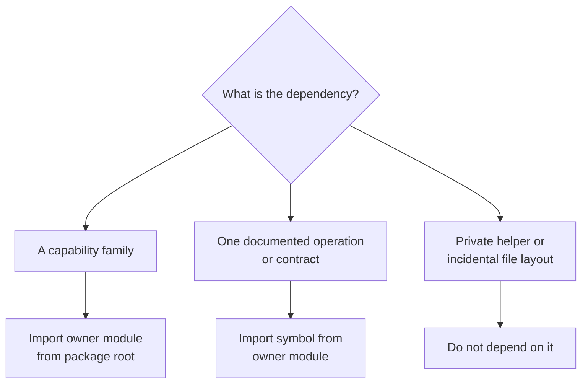

# Public imports

The intelligence root is a directory of stable owner modules. Import the owner
from the root when discoverability matters, or import a symbol from that owner
when a direct dependency is clearer. Do not expect domain symbols to be
available directly from `bijux_proteomics_intelligence`.



## Owner-module imports

```python
from bijux_proteomics_intelligence import interpretation, judgment, reviews
```

This style makes architectural ownership visible and is useful when several
operations from the same family are used together.

## Direct symbol imports

```python
from bijux_proteomics_intelligence.candidates import (
    RankingWeights,
    rank_candidates,
)
from bijux_proteomics_intelligence.reviews import (
    build_intelligence_report_contract,
)
```

This style is appropriate for a focused dependency on an exported operation or
contract. The owning module's `__all__`, documentation, and public API tests
define the supported facade.

## Candidate type distinction

The `candidates` facade exposes two records named for different roles:

- `Candidate` is the validated Pydantic schema from `candidates.schema`, with
  structures and creation metadata;
- `RankedCandidate` is the immutable ranking record from `candidates.records`,
  re-exported under an explicit alias to prevent a name collision.

Import the type matching the receiving operation. Ranking functions currently
consume `RankedCandidate` records; persistence and richer candidate exchange
use the validated `Candidate` schema. Do not remove the alias in local code or
assume the two models are interchangeable.

## Avoid accidental interfaces

- Do not import underscore-prefixed helpers.
- Do not depend on a class found only in an implementation file when the owner
  facade omits it.
- Do not import knowledge or core models through intelligence as a shortcut;
  import them from their owning packages.
- Do not call a review renderer as if it were the underlying scientific
  decision operation.
- Do not treat lazy attribute discovery in `judgment` as evidence that every
  implementation symbol is a durable public API.

Import stability does not preserve decision meaning by itself. Policy defaults,
metric direction, tie-breaking, refusal thresholds, support statuses, and
report fields are compatibility surfaces too. Review them with
[Data contracts](data-contracts.md) and
[Compatibility commitments](compatibility-commitments.md).
