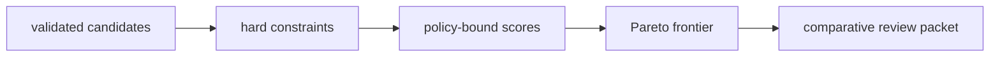

# Decision workflows

Intelligence turns governed evidence into an advisory action while preserving
the reasons to disagree. A normal workflow produces more than a rank: it
produces policy lineage, challenges, uncertainty, refusal state, and a review
packet.

## Candidate review

Use candidate selection when multiple protein or assay candidates must be
compared under shared metrics.

1. Validate identifiers, sequence, provenance, metrics, and confidence inputs.
2. Apply hard constraints before scoring; retain exclusion flags.
3. Declare ranking factors, directions, weights, and tie-breaking policy.
4. Compute ranked scores and the Pareto frontier.
5. Freeze a proposed shortlist with `human_required=true`.
6. Build a comparative review packet before progression.

Review factor-level reasons and provenance, not only final ordering. A candidate
with high structural confidence but weak empirical evidence should remain
distinguishable from one supported by orthogonal observations.

## Claim challenge

Before generating a recommendation, evaluate each consequential claim through
four independent routes:

| Route | Result |
| --- | --- |
| support validation | whether cited evidence satisfies declared claim support |
| contradiction detection | conflicting claim pairs, relationship, and severity |
| falsifier generation | evidence that would overturn the claim |
| strong-claim refusal | invalid design, failed QC, weak peptide support, or low localization |

Refusal does not delete the claim. It blocks a stronger use and names the
minimum evidence required for reconsideration.

## Scenario recommendation

Evaluate plausible scenarios separately, preserving action, confidence,
hypothesis status, and unresolved questions. Then derive:

- consensus or conflicting actions;
- hold pressure and confidence spread;
- escalation flags and required human arbitration;
- the ordered downgrade chain;
- the final advisory action or refusal.

Counterfactual review should remove or perturb important support—comparators,
literature, lab capacity, thresholds, or weights—and record whether the action
changes. Sensitivity is part of the result, not a private diagnostic.

## Review board

A board packet should contain candidate comparisons, evidence lines, claim
challenges, scenario disagreement, unresolved questions, and next-experiment
options. Record agenda, votes, abstentions, decision, and evidence freshness.
Do not replace the packet with meeting notes.

When advice is promoted to enforced policy, wrap it in an enforced decision
support envelope with policy identity, promoting actor, and rationale. Without
that promotion record, the output remains advisory.

## Feedback and learning

Observed lab outcomes may update confidence, regret, calibration, and future
priorities. Append a new decision record linked to the prior recommendation and
the new evidence. Preserve what was known, what action was proposed, and what
changed afterward.

## Completion criteria

A decision workflow is complete when the candidate and evidence inputs are
identifiable, ranking policy is recoverable, contradictions and falsifiers are
visible, refusal gates were applied, uncertainty and scenario disagreement are
preserved, human authority is explicit, and the output can be reconstructed
from its typed records.

See [decision data contracts](../interfaces/data-contracts.md) and
[decision artifact contracts](../interfaces/artifact-contracts.md) for the
machine-readable boundary.
