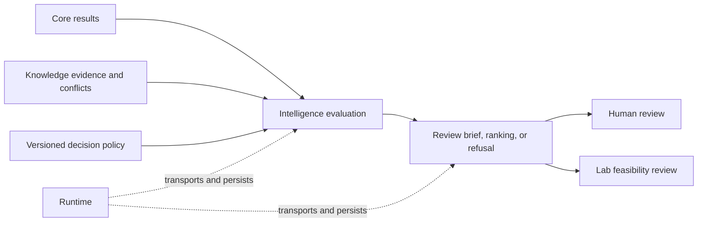

# Deployment Boundaries

Intelligence is deployable decision logic, not an autonomous decision maker. A host may run it in a batch job, notebook, review application, or Runtime workflow, but the package owns only the analytical recommendation and its explanation.

## Host obligations

The deploying application must provide:

- compatible, provenance-bearing Core and Knowledge inputs;
- an identified policy, thresholds, scenario assumptions, and tie behavior;
- access control for sensitive scientific or portfolio data;
- immutable input and output artifacts when decisions require audit;
- a human or governed downstream gate before consequential action;
- monitoring for failed evaluation, policy drift, and incomplete reports.

Intelligence returns typed rankings, readiness, interpretation, contradictions, falsifiers, decision paths, review artifacts, and refusals. Runtime may schedule and persist these operations; Lab may assess assay practicality. Neither role transfers its authority back into Intelligence.

## Prohibited deployment posture

Do not deploy a score as an unattended promotion, rejection, treatment, procurement, or experimental-execution decision. A recommendation can be internally consistent while its source evidence is incomplete, its policy is unsuitable, or its operational consequence is infeasible.

Do not hide policy in environment-specific constants. Two deployments using different weights or thresholds must emit different policy identities, even if they run the same package version.

Do not make remote evidence retrieval or mutation an implicit part of evaluation. Load and validate evidence before calling Intelligence so the resulting artifact has a closed input set that can be replayed.

## Release and rollback

For a policy or package rollout:

1. replay representative and adversarial fixtures under both versions;
2. compare candidate order, readiness, refusals, rationales, uncertainty, and unresolved questions;
3. classify every changed recommendation as intended or unexplained;
4. run blinded and counterfactual challenge surfaces where applicable;
5. publish the package and policy identities together;
6. retain the previous evaluator and inputs for rollback and review.

Rollback restores the prior decision system, not merely the prior wheel. A package downgrade with a newer policy can still produce a novel recommendation.

## Output contract

Every deployed result should remain advisory, attributable, and reopenable. Store the input fingerprints, policy identity, package versions, output fingerprint, caveats, and refusal state beside the rendered report. Presentation layers may summarize the result but must not omit the evidence limits that changed its posture.
