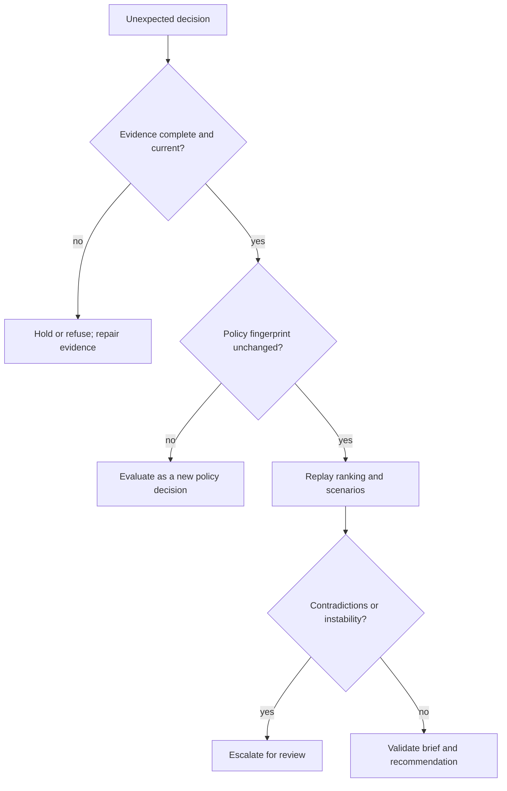

# Failure Recovery

An intelligence result is recoverable only when its decision path can be
reconstructed. Restoring the previous rank or recommendation without the same
evidence cohort, policy lineage, contradictions, and uncertainty would create a
new opaque decision rather than recover the old one.

## Preserve the decision context

Before rerunning, retain candidate records, evidence references, freshness
assessment, contradiction report, factor definitions and weights, policy
lineage or fingerprint, scenario inputs, refusal thresholds, and the original
review artifacts. Record package and contract versions. These elements explain
why a result was produced; a final score does not.

Classify the failure before changing inputs:

| Finding | Recovery response |
| --- | --- |
| Missing, stale, or contradictory evidence | Repair or refresh the evidence set; keep the prior recommendation on hold. |
| Invalid factor, weight, or policy lineage | Correct the policy and issue a new decision context. |
| Deterministic replay produces different ordering | Treat as an evaluator defect or version drift and escalate. |
| Scenario actions disagree materially | Preserve the spread and require review; do not average away the disagreement. |
| Strong claim fails support or localization thresholds | Keep the structured refusal and request the named next check. |
| Review-board decision lacks rationale or evidence references | Return it for completion rather than inferring approval. |

## Replay and compare

Replay with the exact evidence identifiers and policy configuration. Compare
candidate order, per-factor contributions, confidence, evidence posture,
scenario actions, refusals, unresolved questions, and follow-up actions. If the
evidence or policy changed, compare the two decisions as separate attributable
evaluations and explain each movement.

Do not overwrite review history or convert `hold`, `redesign`, escalation, or a
refused claim into `advance` to unblock downstream work. Learning records may
inform future posture, but they must not rewrite the evidence and rationale of a
past decision.

Recovery is complete when the result is reproducible from a named evidence set
and policy, every high-confidence claim has a belief-audit row, contradictions
remain visible, and the review packet explains whether the recommendation was
restored, deliberately changed, or still refused.
