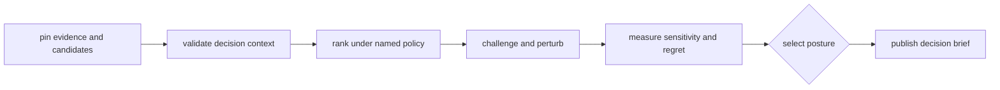

# Operating decision workflows

An Intelligence workflow starts from a fixed evidence revision and complete
candidate universe. It validates inputs, applies a named policy, challenges the
ranking, and publishes an advisory result with enough detail to reproduce or
contest the judgment.

## Standard operating sequence

1. Pin Core results, Runtime provenance, and the Knowledge review revision.
2. Validate candidate identities, required attributes, exclusions, and
   duplicates.
3. Normalize and fingerprint the decision policy and program constraints.
4. Retain component scores, ranking, ties, dominated alternatives, and selected
   candidates.
5. Run contradictions, falsifiers, blinded challenges, scenarios, and
   counterfactuals.
6. Evaluate threshold sensitivity, confidence calibration, and regret.
7. Emit a recommendation, downgrade, escalation, hold, or refusal with a human
   review boundary.

[Common workflows](common-workflows.md) provides concrete package routes and
[installation and setup](installation-and-setup.md) covers the supported local
environment.

## Compare decisions correctly

Do not compare only final ranks. A meaningful comparison identifies changes in:

| Dimension | Review |
| --- | --- |
| evidence | revision, added or removed support, contradictions, freshness |
| candidate universe | additions, exclusions, deduplication, changed attributes |
| policy | weights, objectives, constraints, thresholds, tie-breaking |
| challenge | scenarios, falsifiers, withheld evidence, perturbation range |
| outcome | ordering, posture, confidence, regret, human-review requirement |

A rank change is expected when a named input changes. An unexplained rank
change under identical normalized inputs is a reproducibility failure.

## Diagnose recommendation behavior

| Symptom | Inspect first | Safe response |
| --- | --- | --- |
| winner changed unexpectedly | input fingerprints and policy identity | compare contexts before debugging scores |
| scores look plausible but cannot be explained | component ledger and tie-breaking | refuse publication until lineage is complete |
| recommendation is brittle | threshold and scenario sensitivity | downgrade, escalate, or request discriminating evidence |
| confidence remains high after failures | calibration corpus and regret | recalibrate under a new policy record |
| report omits a contradiction | evidence revision and challenge assembly | correct the brief; preserve original decision history |
| downstream treats advice as approval | posture and handoff contract | restore explicit human or Lab authority |

[Observability and diagnostics](observability-and-diagnostics.md) maps artifacts
to these questions. [Failure recovery](failure-recovery.md) preserves decision
history while correcting inputs, policy, or review assembly.

## Scaling and security

Portfolio evaluation, parallel scenarios, and cached metrics must remain
equivalent to the supported serial policy, including deterministic ordering and
tie-breaking. Performance work cannot reduce the challenge set silently. See
[performance and scaling](performance-and-scaling.md).

Decision artifacts may contain sensitive program constraints, unpublished
evidence, and candidate priorities. Apply least-privilege access and avoid
embedding secrets or restricted source material. [Security and safety](security-and-safety.md)
and [deployment boundaries](deployment-boundaries.md) define those limits.

## Release boundary

A default-policy or schema change can alter decisions without changing an
import path. [Release and versioning](release-and-versioning.md) therefore
requires before-and-after decisions over fixed corpora, challenge and
calibration evidence, compatibility review, and explicit public posture.
