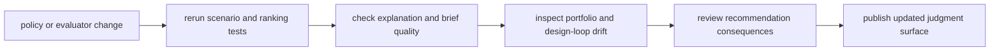

# Operations

`bijux-proteomics-intelligence` operations is about changing judgment without
making it arbitrary. Maintainers here are not just shipping code. They are
shipping policy behavior, recommendation quality, and explanation patterns that
people may use to decide what gets advanced, redesigned, or paused.

## What Operations Means Here

- recommendation drift is an operational concern, not just a modeling concern
- a passing test suite is incomplete if explanations become harder to trust
- maintainers need to reason about output quality across scenarios, not only
  single-function correctness

## Start With

- open [Common Workflows](https://bijux.io/bijux-proteomics/05-bijux-proteomics-intelligence/operations/common-workflows/)
  when you need the standard path from policy edit to trustworthy release
- open [Observability and Diagnostics](https://bijux.io/bijux-proteomics/05-bijux-proteomics-intelligence/operations/observability-and-diagnostics/)
  when rankings, briefings, or scenario outputs no longer look believable
- open [Failure Recovery](https://bijux.io/bijux-proteomics/05-bijux-proteomics-intelligence/operations/failure-recovery/)
  when recommendation behavior already regressed in a way humans can see
- open [Release and Versioning](https://bijux.io/bijux-proteomics/05-bijux-proteomics-intelligence/operations/release-and-versioning/)
  before publishing any change that alters policy defaults or explanation shape

## Route From Operating Concern

- [Local Development](https://bijux.io/bijux-proteomics/05-bijux-proteomics-intelligence/operations/local-development/)
  and [Installation and Setup](https://bijux.io/bijux-proteomics/05-bijux-proteomics-intelligence/operations/installation-and-setup/)
  for reproducible scoring and evaluation work
- [Deployment Boundaries](https://bijux.io/bijux-proteomics/05-bijux-proteomics-intelligence/operations/deployment-boundaries/)
  and [Security and Safety](https://bijux.io/bijux-proteomics/05-bijux-proteomics-intelligence/operations/security-and-safety/)
  for the limits that stop recommendation logic from becoming hidden authority
- [Performance and Scaling](https://bijux.io/bijux-proteomics/05-bijux-proteomics-intelligence/operations/performance-and-scaling/)
  when evaluation volume, portfolio breadth, or report generation cost becomes
  the practical bottleneck

## First Proof Check

- `src/bijux_proteomics_intelligence/policies.py` and `evaluators.py`
- `src/bijux_proteomics_intelligence/report/` and `outcomes.py`
- `packages/bijux-proteomics-intelligence/tests`
