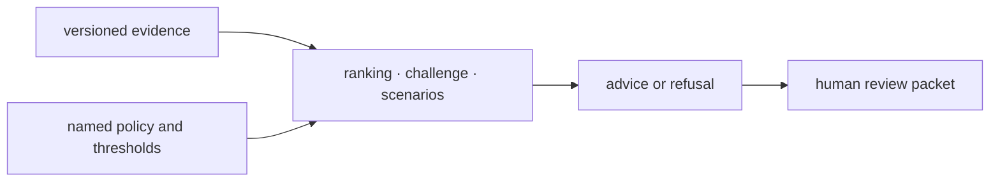

# Local development

Intelligence turns governed evidence into advisory rankings, challenges,
scenarios, refusals, and review packets. A local change is safe only when a
reviewer can recover which input, policy, or uncertainty changed the advice.
Higher scores or more decisive outputs are not success criteria by themselves.

## Run the package gates

Use package dispatch from the repository root:

```bash
make lint PACKAGE=bijux-proteomics-intelligence
make test PACKAGE=bijux-proteomics-intelligence
make quality PACKAGE=bijux-proteomics-intelligence
make api PACKAGE=bijux-proteomics-intelligence
```

Run `make build PACKAGE=bijux-proteomics-intelligence` when public modules,
compatibility exports, metadata, or packaged fixtures change. Generated results
remain under `artifacts/`.

## Isolate the decision lever



Change one decision lever at a time: factor direction, weight, hard constraint,
threshold, tie policy, refusal rule, or scenario assumption. Keep the previous
policy fixture available and compare the complete output, not only the final
action. Candidate exclusions, factor contributions, Pareto state,
contradictions, falsifiers, confidence, and unresolved questions can reveal
meaningful drift hidden by an unchanged recommendation.

## Choose evidence by change type

| Change | Required evidence |
| --- | --- |
| ranking policy | factor-level reasons, ties, exclusions, and order stability |
| refusal rule | accepted boundary, refused boundary, and required remediation |
| scenario logic | agreement, disagreement, hold pressure, and escalation cases |
| counterfactual | named perturbation and whether the action changes |
| report contract | all decision inputs and policy lineage remain recoverable |
| learning update | prior decision is immutable and new outcome linkage is explicit |

Use synthetic fixtures to isolate policy behavior and representative governed
fixtures to establish integration. Label synthetic evidence honestly; it must
not appear to be an observed scientific result.

## Preserve authority boundaries

Intelligence remains advisory unless an explicit promotion record gives an
output enforced status. It does not execute workflows, curate source evidence,
or authorize laboratory work. Refusal is a first-class result when evidence,
design, or review requirements are insufficient.

The change is ready when identical inputs and policy remain deterministic, each
changed recommendation has an inspectable reason, uncertainty is not erased,
refusal and human authority remain explicit, and review artifacts reconstruct
the decision without private implementation knowledge.
