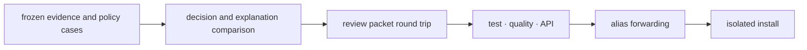

# Release and versioning

Intelligence follows the repository's Git-tag-derived version line through
`hatch-vcs`. Release review focuses on whether a consumer can reproduce and
challenge an advisory outcome under the released evidence and policy.

## Classify decision impact

| Change | Release question |
| --- | --- |
| internal implementation | do frozen decision cases retain every observable field? |
| new diagnostic | can existing consumers ignore it without losing meaning? |
| policy default | which rankings, refusals, or actions change? |
| report schema | can stored packets still be loaded or migrated? |
| confidence semantics | does the same value now support a different conclusion? |
| authority boundary | can advisory output be mistaken for enforced action? |

Policy and implementation versions must remain distinguishable. A code release
can support several explicit policies, and a policy change can alter advice
without a new model class. Store policy identity with each decision artifact.

## Release evidence chain



Run the package gates from the repository root:

```bash
make test PACKAGE=bijux-proteomics-intelligence
make quality PACKAGE=bijux-proteomics-intelligence
make api PACKAGE=bijux-proteomics-intelligence
make build PACKAGE=bijux-proteomics-intelligence
make test PACKAGE=proteomics-intelligence
```

The decision comparison includes rank order, factor contributions, hard
exclusions, Pareto membership, contradictions, falsifiers, scenario spread,
refusal state, confidence, and next actions. If any move, the release evidence
explains why and identifies affected consumer behavior.

## Changelog contract

Update `packages/bijux-proteomics-intelligence/CHANGELOG.md` with the affected
decision surface, policy identity, before-and-after consequence, artifact
compatibility, and required consumer action. Describe explanation-only changes
separately from changes that can alter an action.

Coordinate with Knowledge when evidence interpretation or claim structures
move, with Core when scientific metrics change, and with Lab when advice feeds
planning. Coordination does not transfer ownership: Knowledge curates evidence,
Core owns scientific calculations, Intelligence advises, and Lab authorizes
physical work.

After publication, install the exact wheel into an empty environment, load a
frozen evidence-and-policy case, build its review artifact, and compare the
decision record with the release dossier. Verify the `proteomics-intelligence`
alias when the public module surface changes. These checks establish consumer
reproducibility beyond successful package upload.
