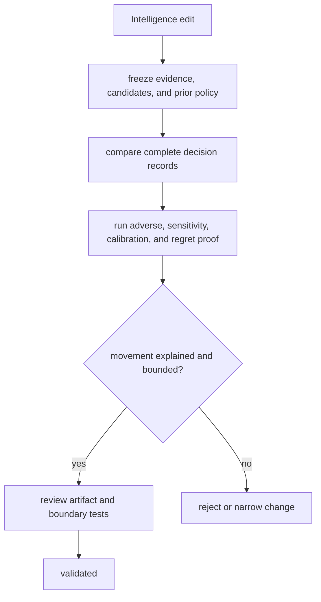

# Change validation

Validate an Intelligence change against a fixed decision corpus and explain
every intended movement in candidates, component results, ranking, posture,
confidence, regret, or authority.

## Change-to-proof map

| Change | Required proof | Downstream review |
| --- | --- | --- |
| candidate schema, filter, or fingerprint | valid/invalid, duplicate, exclusion, missing, stable identity, complete universe | review packet and stored candidate consumers |
| component metric | orientation, scale, boundaries, missingness, explanation, sensitivity | policy composition and public report |
| ranking or selection policy | fixed corpus, normalized policy, ties, constraints, alternatives, deterministic order | recommendation posture and Lab handoff |
| contradiction, falsifier, or skeptical posture | adverse, irrelevant, conflicting, and unresolved cases | Knowledge evidence linkage |
| confidence or calibration | named corpus, predicted/observed relationship, drift and outside-envelope behavior | public confidence language |
| regret or consequence model | alternative actions, cost assumptions, boundary values, reversal cases | Lab burden and outcome evidence |
| learning or adaptation | immutable prior policy, outcome lineage, new policy identity, before/after corpus | historical review records |
| decision brief or review artifact | complete lineage, round trip, stable assembly, authority and refusal | reader and operator interpretation |

## Validation route

Do not approve a change because benchmark recommendations moved toward an
expected answer. Establish why they moved and which cases became weaker,
stronger, held, or refused. Unexpected non-movement is also a finding when a
new contradiction or cost should have changed posture.

## Validation record

State evidence revision, candidate universe, prior and new normalized policy,
changed components, ties and alternatives, challenge findings, sensitivity,
calibration corpus, regret assumptions, posture, authority, exact checks, and
unresolved drift. Preserve both decision records for policy changes.
