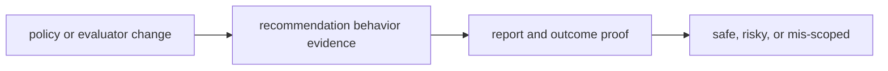

# Change Validation

Change validation should make it obvious whether a package edit is safe, risky, or mis-scoped.

## Validation Model

This page should make intelligence validation about explainable recommendation
movement. A change is safe only when behavior shifts can be demonstrated and
explained through the same policy and reporting surfaces readers will inspect.

## Review Rules

- require evidence that a policy or evaluator change improves or intentionally changes recommendation behavior
- run report and outcome proof with decision logic changes
- reject edits that make recommendation drift harder to explain

## First Proof Check

- `packages/bijux-proteomics-intelligence/tests`
- `src/bijux_proteomics_intelligence/candidates/`, `judgment/`, and `posture/`
- `src/bijux_proteomics_intelligence/reviews/`, `interpretation/`, and `learning/`

## Design Pressure

Recommendation quality drifts fast when policy edits are accepted on intuition
alone. Validation has to force evidence that the system moved on purpose and
that the explanation survived the move.
