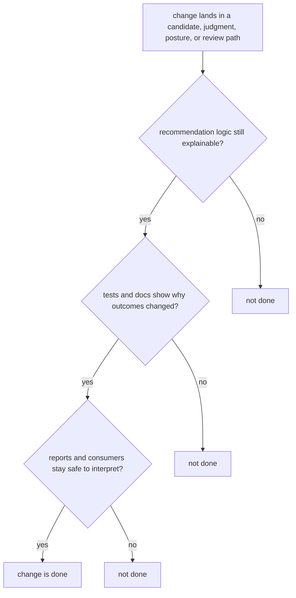

# Definition of Done

Done means the package is easier to trust after the change, not just that the diff merged.

For `bijux-proteomics-intelligence`, done means a changed recommendation path is easier to justify in reader language than it was before the edit.

## Completion Model

The important threshold is explanation, not just score movement. If the outcome changed and the page still cannot tell a reviewer why, the work is incomplete.

## Review Rules

- the changed recommendation path is easier to justify than before
- tests and docs explain the outcome shift in reader language
- downstream consumers can still interpret outputs safely

## First Proof Check

- `packages/bijux-proteomics-intelligence/tests`
- `src/bijux_proteomics_intelligence/candidates/`, `judgment/`, and `posture/`
- `src/bijux_proteomics_intelligence/reviews/`, `interpretation/`, and `learning/`

## Design Pressure

The easy mistake is to accept a recommendation change because the numbers moved in the expected direction, even though the justification path became harder to inspect.
