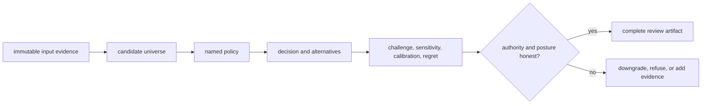

# Definition of done

An Intelligence change is complete when a reviewer can reproduce the decision,
recover the alternatives and exclusions, challenge its stability, and see why
the output recommends, downgrades, holds, escalates, or refuses. A plausible
winner is not enough.

## Completion by decision surface

| Changed surface | Required evidence | Blocking omission |
| --- | --- | --- |
| candidate record or filter | complete candidate universe, validation, exclusions, and fingerprints | only the selected candidate survives review |
| metric or component score | orientation, scale, missing-data behavior, boundaries, and explanation | a number changes without a semantic account |
| ranking policy | normalized policy, deterministic order, ties, constraints, and alternatives | hidden defaults or unstable tie-breaking |
| recommendation posture | support, contradiction, downgrade, hold, escalation, and refusal cases | every input produces a positive recommendation |
| confidence or calibration | named corpus, predicted-versus-observed behavior, and uncertainty | score language implies probability without calibration |
| sensitivity or regret | plausible policy and evidence perturbations, reversals, and alternative cost | recommendation hides material instability or downside |
| learning or adaptation | immutable prior policy, new policy identity, outcome lineage, and before/after evidence | historical decisions are rewritten in place |
| review artifact | evidence revision, candidate set, policy, challenge findings, authority, and round trip | report cannot reconstruct the decision path |

## Decision evidence loop

Run the focused candidate, judgment, posture, or learning tests, then the
package boundary tests for Foundation, Core, Knowledge, Runtime, and Lab
contracts touched by the output. A recommendation that crosses into assay or
execution planning also requires consumer proof; Intelligence tests cannot
grant downstream authority.

## Completion record

Preserve the input evidence revision, candidate set and exclusions, normalized
policy, component results, alternatives, challenge findings, sensitivity,
calibration source, regret assumptions, posture, and human or Lab handoff.
State checks not run and keep the public claim inside that envelope.

## Not complete

The work remains incomplete when expected rank movement is accepted without an
explanation, missing evidence silently becomes a neutral score, an adverse
scenario disappears from the packet, or a learned policy overwrites the
decision context that produced earlier recommendations.
