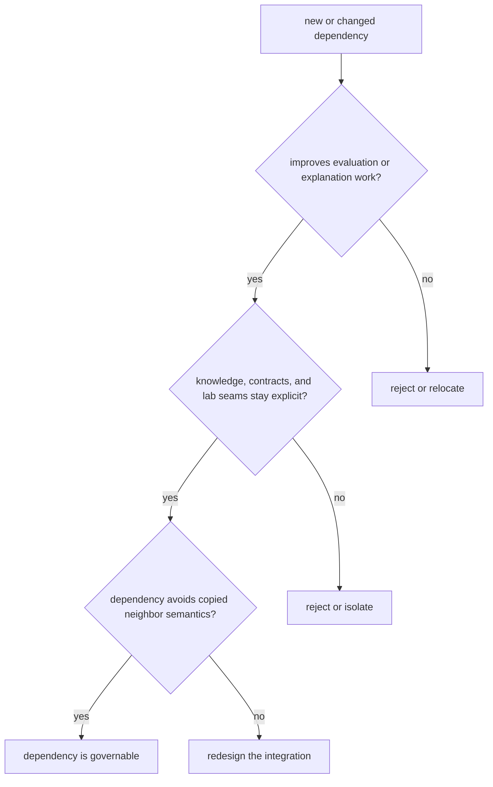

# Dependency Governance

Dependency governance is really boundary governance under another name.

For `bijux-proteomics-intelligence`, dependency review should keep evidence, contracts, and lab execution explicit instead of letting the package collapse into a hidden application layer.

## Governance Model

This page should make it obvious that a recommendation package gets weaker when it starts owning evidence semantics or execution behavior through dependency shortcuts.

## Review Rules

- guard the seams to evidence, contracts, and lab execution carefully
- avoid dependencies that turn the package into a hidden application layer
- prefer explicit inputs from neighbors over copied semantics

## First Proof Check

- `packages/bijux-proteomics-intelligence/tests`
- `src/bijux_proteomics_intelligence/candidates/`, `judgment/`, and `posture/`
- `src/bijux_proteomics_intelligence/reviews/`, `interpretation/`, and `learning/`

## Design Pressure

The easy mistake is to accept a useful dependency that lets intelligence behave like the application shell instead of a bounded decision layer.
