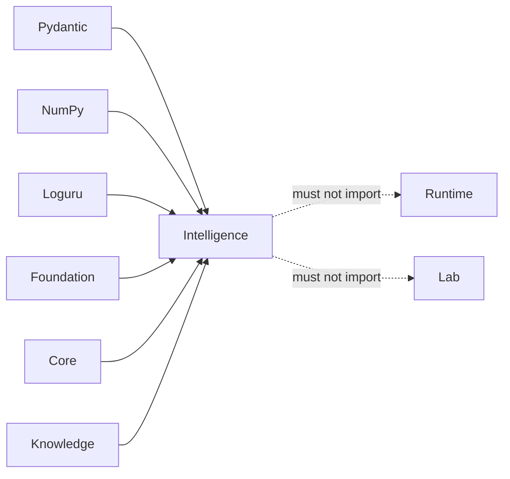

# Dependency Governance

Dependencies must strengthen judgment without transferring another package's
authority into Intelligence. The installed graph is intentionally one-way:
Foundation, Core, and Knowledge provide contracts or evidence; Intelligence
produces decision artifacts for downstream consequence review.

## Current Dependency Contract

| Dependency | Permitted role | Boundary to protect |
| --- | --- | --- |
| `bijux-proteomics-foundation` | shared identifiers, provenance, stable contracts | do not fork shared meanings locally |
| `bijux-proteomics-core` | scientific result types and computations used by judgment | do not make Intelligence an alternate scientific engine |
| `bijux-proteomics-knowledge` | claims, evidence, citations, lineage, contradiction records | do not mutate custody or redefine evidence truth |
| Pydantic | validation and serialization of decision artifacts | model shape must not substitute for semantic ownership |
| NumPy | bounded numeric evaluation and ranking support | record orientation, missingness, tolerance, and deterministic behavior |
| Loguru | observable diagnostics | logs are not retained decision evidence |

Runtime and Lab are deliberately absent. Importing either would let decision
policy control execution or consequence recording and would create a cycle in
the product flow.

## Admission Test

A dependency is acceptable only when:

1. Its role maps to an owned decision capability.
2. It does not introduce a second representation of an upstream contract.
3. Its optional or failure behavior is explicit at the public boundary.
4. Numeric behavior is deterministic or its variability is captured.
5. It does not pull Runtime, Lab, network access, or storage policy into the
   recommendation layer.
6. Focused tests prove the seam and dependency checks prove the graph.

Prefer a narrow typed input over importing a neighbor's application service.
Prefer a recorded evidence reference over reaching into Knowledge storage.
Prefer returning a decision artifact over invoking a downstream action.

## Rejection Signals

Reject or redesign a dependency that requires hidden global state, changes
ranking through an unrecorded default, owns evidence persistence, starts work,
records laboratory outcomes, or duplicates a model already owned upstream.
Convenience is not sufficient justification for crossing an authority
boundary.
