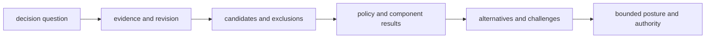

# Documentation standards

Public recommendation language must expose the reasoning path and its authority
boundary. A polished conclusion without its candidate universe, evidence
revision, policy, alternatives, instability, and refusal conditions is not a
reviewable Intelligence result.

## Recommendation vocabulary

| Term | Required context | Must not imply |
| --- | --- | --- |
| **score** | component definition, orientation, scale, missingness, and policy version | calibrated probability or biological truth |
| **rank** | candidate universe, exclusions, tie-breaking, constraints, and alternatives | absolute merit outside the compared set |
| **confidence** | calibration method, corpus, interval or category meaning, and known drift | certainty because a value is numerically high |
| **recommend** | evidence revision, policy, challenge results, regret, and authority | autonomous approval or guaranteed outcome |
| **downgrade** | adverse evidence or sensitivity condition that weakened posture | implementation failure |
| **hold** | missing decision-critical evidence and the evidence needed to resume | a weak positive recommendation |
| **refuse** | explicit violated precondition or unacceptable uncertainty | missing output or exception |

## Reviewable narrative

Examples finish at a decision brief or review packet, not an isolated score.
They show at least one alternative, one adverse or contradictory condition,
and the reason the final posture is no stronger. When a small plausible policy
change reverses the action, the instability belongs beside the recommendation.

## Source and authority

Reference Knowledge evidence rather than copying it into a new truth record.
Name the policy and configuration that transformed evidence into a decision.
Keep Lab feasibility and Runtime execution as downstream evidence. Intelligence
may propose or refuse an action; it does not authorize laboratory work or
declare execution successful.

## Updating a public result

A new evidence revision or learned policy produces a new decision record.
Compare old and new outcomes and explain the changed inputs or policy. Do not
rewrite earlier rationale as though the later information had always been
available.

[Known limitations](known-limitations.md) defines the inference ceiling, and
[definition of done](definition-of-done.md) lists the evidence required after a
decision-path change.
