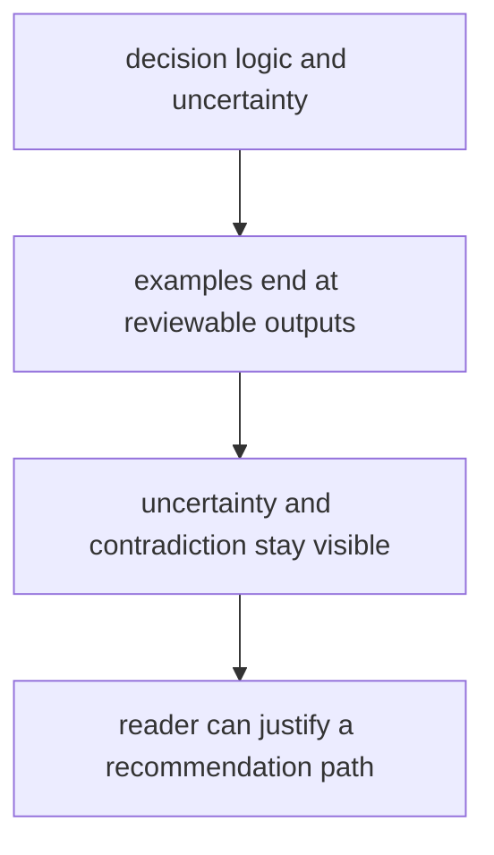

# Documentation Standards

Documentation standards should protect the reader from filler, drift, and false confidence.

For `bijux-proteomics-intelligence`, documentation should privilege explanation quality over breadth and end examples at reviewable outputs rather than hidden internal scores.

## Documentation Model

This page should keep the package from sounding smarter than it is. Good docs make readers inspect the reasoning path, not merely admire the result surface.

## Review Rules

- docs should prioritize explanation quality over breadth
- examples should end with reviewable outputs
- quality pages should make uncertainty and contradiction visible

## First Proof Check

- `packages/bijux-proteomics-intelligence/tests`
- `src/bijux_proteomics_intelligence/candidates/`, `judgment/`, and `posture/`
- `src/bijux_proteomics_intelligence/reviews/`, `interpretation/`, and `learning/`

## Design Pressure

The easy failure is to write persuasive output prose that hides how much uncertainty and evidence-shape still matter underneath.
