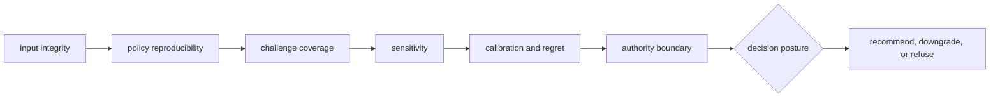

# Decision quality

Intelligence quality is the ability to reproduce, challenge, and bound a
recommendation. It requires more than a stable ranking: evidence lineage,
candidate completeness, policy identity, alternative actions, sensitivity,
calibration, regret, refusal, and authority must all remain reviewable.

## Quality dimensions

| Dimension | Evidence | Blocking failure |
| --- | --- | --- |
| candidate integrity | complete universe, validation, exclusions, fingerprints | winning candidate shown without excluded alternatives |
| evidence fidelity | immutable artifact references and revision | copied or altered evidence inside the decision model |
| policy reproducibility | normalized policy, components, ordering, tie-breaking | same context produces unexplained rank drift |
| challenge strength | contradictions, falsifiers, blinded and counterfactual cases | recommendation survives only because adverse cases were omitted |
| stability | threshold, weight, scenario, and missing-data sensitivity | plausible change reverses action without downgrade |
| calibration | predicted confidence versus benchmark and outcome behavior | systematic overconfidence remains unreported |
| regret | cost of selected versus plausible alternative actions | recommendation hides material downside |
| authority | posture, refusal, escalation, human and Lab handoff | advisory output is treated as autonomous approval |

## Proof by change type

| Change | Minimum proof |
| --- | --- |
| candidate model or filter | valid, invalid, missing, duplicate, exclusion, fingerprint cases |
| metric or scoring component | orientation, scale, boundary values, missingness, explanation |
| ranking policy | fixed corpus, ties, constraints, alternatives, deterministic order |
| recommendation posture | support, contradiction, downgrade, escalation, hold, refusal |
| confidence or learning | calibration corpus, outcome lineage, before-and-after regret |
| review artifact | complete input lineage, challenge findings, round trip, consumer boundary |

[Test strategy](test-strategy.md) and [change validation](change-validation.md)
map these obligations to executable checks.

## Invariants

- a decision references, rather than rewrites, upstream evidence;
- the candidate universe and exclusions are recoverable;
- policy and normalized configuration identify the behavior applied;
- component scores, alternatives, and tie-breaking remain inspectable;
- contradiction and instability can weaken or stop a recommendation;
- learning creates a new policy record and preserves historical decisions;
- an advisory artifact never grants execution or laboratory authority.

See [invariants](invariants.md) for the complete set.

## Honest negative outcomes

Downgrade, escalation, hold, and refusal are successful outputs when evidence or
stability is inadequate. Tests must exercise these paths directly. A fallback
that always returns a winner is not robust decision support; it is a hidden
policy that prevents the system from admitting uncertainty.

Known evidence ceilings, calibration gaps, and workflow-family limits remain in
[known limitations](known-limitations.md). Ownership and decision risks remain
in the [risk register](risk-register.md).

## Review route

Use [dependency governance](dependency-governance.md) for upstream model and
optional analysis dependencies, [documentation standards](documentation-standards.md)
for recommendation language, and [review checklist](review-checklist.md) before
handoff. [Definition of done](definition-of-done.md) requires explicit results
for challenge, sensitivity, calibration, and remaining blockers.
