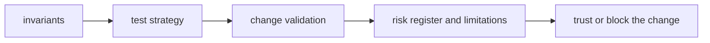

# Quality

`bijux-proteomics-intelligence` quality should tell a reviewer what must remain true, what proof is required, and which risks are serious enough to block a change.

## Trust Model

This page should make intelligence quality about explainability pressure. The
package earns trust when recommendation behavior can still be justified through
candidate ranking, judgment paths, decision briefs, and recommendation outputs
instead of opaque drift.

## Start With

- open [Invariants](https://bijux.io/bijux-proteomics/05-bijux-proteomics-intelligence/quality/invariants/) before changing package meaning
- open [Change Validation](https://bijux.io/bijux-proteomics/05-bijux-proteomics-intelligence/quality/change-validation/) when you need the minimum proof for a real edit
- open [Risk Register](https://bijux.io/bijux-proteomics/05-bijux-proteomics-intelligence/quality/risk-register/) when the package boundary feels under pressure

## Section Pages

- [Invariants](https://bijux.io/bijux-proteomics/05-bijux-proteomics-intelligence/quality/invariants/)
- [Test Strategy](https://bijux.io/bijux-proteomics/05-bijux-proteomics-intelligence/quality/test-strategy/)
- [Change Validation](https://bijux.io/bijux-proteomics/05-bijux-proteomics-intelligence/quality/change-validation/)
- [Definition of Done](https://bijux.io/bijux-proteomics/05-bijux-proteomics-intelligence/quality/definition-of-done/)
- [Dependency Governance](https://bijux.io/bijux-proteomics/05-bijux-proteomics-intelligence/quality/dependency-governance/)
- [Documentation Standards](https://bijux.io/bijux-proteomics/05-bijux-proteomics-intelligence/quality/documentation-standards/)
- [Known Limitations](https://bijux.io/bijux-proteomics/05-bijux-proteomics-intelligence/quality/known-limitations/)
- [Review Checklist](https://bijux.io/bijux-proteomics/05-bijux-proteomics-intelligence/quality/review-checklist/)
- [Risk Register](https://bijux.io/bijux-proteomics/05-bijux-proteomics-intelligence/quality/risk-register/)

## What Quality Means Here

- proving that recommendation changes remain explainable, reviewable, and bounded by decision ownership

## First Proof Check

- `packages/bijux-proteomics-intelligence/tests`
- `src/bijux_proteomics_intelligence/candidates/`, `judgment/`, and `posture/`
- `src/bijux_proteomics_intelligence/reviews/`, `interpretation/`, and `learning/`

## Design Pressure

Intelligence quality breaks down when recommendation changes look plausible but
stop being explainable. The section has to force proof that behavior changed on
purpose and remains reviewable.
