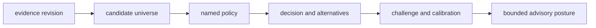

# Invariants

Intelligence invariants make every decision reproducible, challengeable, and
bounded. They apply whether the output is a ranking, recommendation, downgrade,
hold, escalation, or refusal.

## Decision invariants

| Invariant | What remains reviewable | Observable violation |
| --- | --- | --- |
| evidence is referenced, not rewritten | upstream artifact identity and revision | decision record contains altered evidence with no lineage |
| candidate scope is recoverable | full considered set, exclusions, duplicates, and fingerprints | only the winner is retained |
| policy is identified | normalized configuration, components, weights, thresholds, constraints, and version | same inputs produce a changed decision through hidden defaults |
| component meaning is explicit | orientation, scale, missing-data behavior, and contribution | a high score has no stable interpretation |
| ordering is deterministic | tie-breaking and stable candidate order | equal candidates reverse by input or hash order |
| adverse evidence can weaken posture | contradictions, falsifiers, instability, and uncertainty reach downgrade, hold, or refusal | every valid input produces a winner |
| confidence stays inside calibration | corpus, method, interval or category meaning, and drift limits | uncalibrated score is presented as probability |
| alternatives and regret remain visible | plausible actions, costs, and consequence assumptions | recommendation hides a materially safer alternative |
| learning is append-only in meaning | prior policy, decision, outcome lineage, new policy, and comparison | adaptation rewrites the rationale for historical decisions |
| authority remains advisory | approving human or Lab authority and Runtime execution stay separate | recommendation becomes automatic authorization |

## Decision equivalence

Equal final ranks do not prove equivalent reasoning. Two policies can produce
the same winner with different component scores, exclusions, sensitivity, or
regret. Review invariants over the entire decision record, not only the selected
candidate.

## Failure response

When an invariant fails, preserve the inputs and intermediate decision record,
then downgrade, hold, or refuse. Do not fill missing evidence with a neutral
score, discard contradictory candidates, or manufacture confidence so a
positive recommendation remains available.
