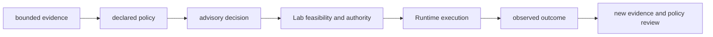

# Known limitations

Intelligence makes decision policy inspectable; it does not turn incomplete
evidence into truth, a ranking into a calibrated probability, or an advisory
artifact into permission to execute.

## Decision limits

| Limitation | Consequence | Responsible interpretation |
| --- | --- | --- |
| every ranking is conditional on its candidate universe | omitted or filtered alternatives can change the apparent winner | publish candidates and exclusions with the result |
| component scores depend on orientation, scale, weights, and missing-data policy | a stable number can encode a changed decision rule | retain normalized policy and component explanations |
| confidence is only as broad as its calibration corpus | calibration may drift across workflow family, instrument, cohort, or consequence | name the corpus and avoid probability language outside it |
| contradiction and falsifier machinery exposes pressure; it does not resolve all disputes | a challenged claim can remain genuinely uncertain | preserve adverse evidence and use hold or refusal when needed |
| sensitivity covers declared perturbations | untested policy or evidence changes may still reverse the decision | report the explored envelope and observed reversals |
| regret depends on modeled alternatives and costs | unmodeled laboratory, time, or opportunity costs can dominate | pair decision review with Lab consequence evidence |
| learning uses retained outcomes and policy assumptions | biased or sparse outcomes can reinforce the wrong policy | version adaptations and preserve the prior decision history |
| Intelligence is advisory | downstream authorization, execution, and scientific acceptance remain separate | route authority to the responsible human, Lab, Runtime, or scientific owner |

## Inference boundary

Each arrow can narrow or reverse the prior posture. Intelligence cannot promise
that the recommended assay is feasible, that execution will succeed, or that
the observed outcome will support the original claim.

## Report the uncertainty

State the evidence revision, candidate scope, policy, calibration corpus,
challenge coverage, sensitivity range, modeled regret, and downstream
authority. If one is absent, name the gap and use a weaker posture. “The model
recommended” is never a sufficient explanation of what was known or why the
action was justified.
