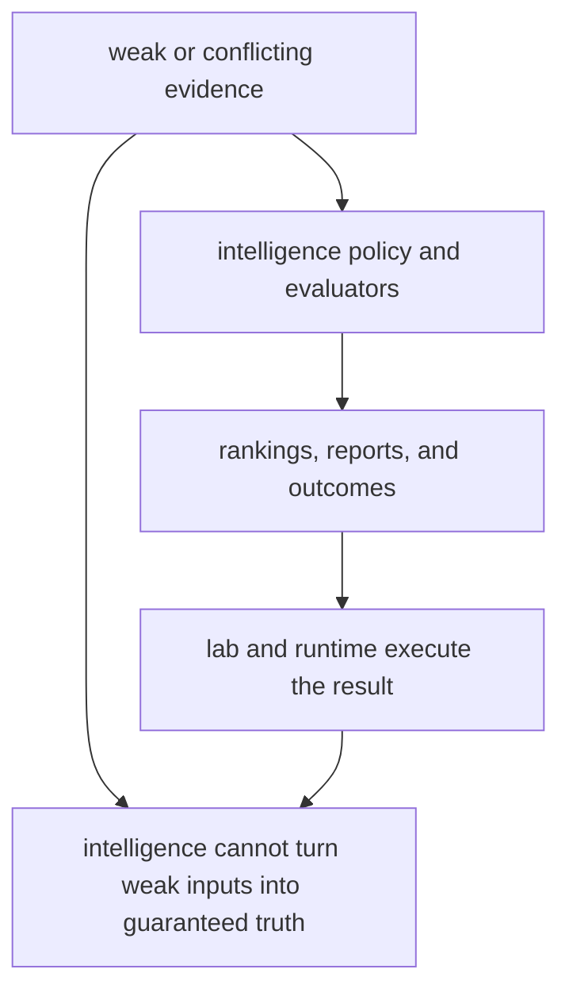

# Known Limitations

Known limitations matter because honest boundaries are part of quality, not an admission of failure.

For `bijux-proteomics-intelligence`, limitations exist wherever recommendation quality depends on evidence strength, operator judgment, or downstream execution outside this package.

## Limitation Model

This page should stop readers from over-claiming what a scoring layer can do. The package can make decisions legible, but it cannot manufacture stronger evidence or guarantee the quality of execution that follows.

## Review Rules

- intelligence cannot make weak evidence strong by itself
- downstream execution quality still depends on lab and runtime surfaces
- recommendation quality is bounded by the transparency of its inputs and outputs

## First Proof Check

- `packages/bijux-proteomics-intelligence/tests`
- `src/bijux_proteomics_intelligence/policies.py` and `evaluators.py`
- `src/bijux_proteomics_intelligence/report/` and `outcomes.py`

## Design Pressure

The common drift is to treat a persuasive recommendation surface as if it were a substitute for evidence quality or downstream operational discipline.
