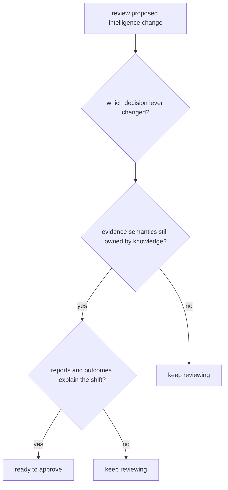

# Review Checklist

A review checklist is useful only if it catches the real ways this package can drift.

For `bijux-proteomics-intelligence`, review should expose which decision lever moved and whether the package is still reasoning from evidence instead of smuggling in new facts.

## Review Model

The reviewer should be able to say what changed in recommendation policy without pretending raw scores explain themselves.

## Review Rules

- ask which decision lever actually changed
- check decision briefs, interpretation summaries, and recommendation outputs before trusting raw scores
- verify that evidence semantics remain owned by the knowledge layer

## First Proof Check

- `packages/bijux-proteomics-intelligence/tests`
- `src/bijux_proteomics_intelligence/candidates/`, `judgment/`, and `posture/`
- `src/bijux_proteomics_intelligence/reviews/`, `interpretation/`, and `learning/`

## Design Pressure

The easy failure is to approve a result that looks directionally plausible while missing that the explanation surface became thinner or the evidence boundary moved.
