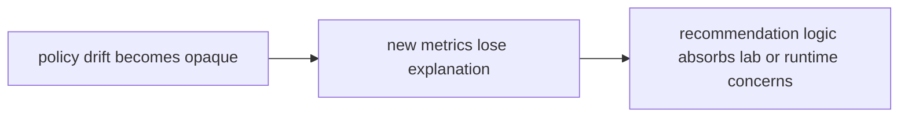

# Risk Register

A risk register should name the structural and behavioral failures that deserve ongoing attention.

## Risk Model

This page should make intelligence risk feel like explainability loss under
decision pressure. The package is in trouble when the system can still rank or
recommend but can no longer explain why in reviewable terms.

## Review Rules

- policy drift becomes opaque
- new metrics land without enough reviewable explanation
- recommendation logic starts absorbing lab or runtime concerns

## First Proof Check

- `packages/bijux-proteomics-intelligence/tests`
- `src/bijux_proteomics_intelligence/policies.py` and `evaluators.py`
- `src/bijux_proteomics_intelligence/report/` and `outcomes.py`

## Design Pressure

Intelligence risk compounds when recommendation movement stays operationally
useful while becoming less interpretable. The register has to keep opaque drift
visible before it becomes normalized.
