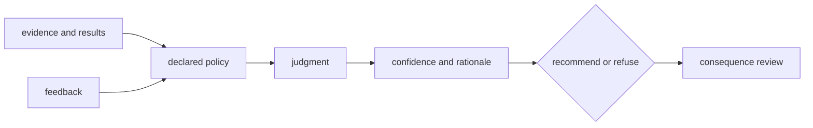

# Risk Register

Intelligence can remain operational while becoming untrustworthy: rankings
still sort, recommendations still serialize, and review packets still render.
The critical risks are therefore silent changes to evidence use, policy,
calibration, explanation, refusal, and downstream authority.

## Active And Structural Risks

| Risk | Observable failure | Required control |
| --- | --- | --- |
| duplicate semantic ownership | the same belief-audit model exists in Core and Intelligence | resolve the active ownership blocker or govern the exact shared contract |
| evidence laundering | a score appears authoritative without source claim and lineage | require Knowledge references and expose missing support |
| policy drift | threshold or default changes move recommendations silently | version policy and compare decision outcomes |
| score orientation error | larger/smaller or sign meaning reverses a rank | type and test orientation at the boundary |
| missingness coercion | absence becomes zero, neutral, or low confidence implicitly | declare missingness semantics and refusal behavior |
| unstable ranking | ties or floating-point differences reorder candidates | deterministic tie policy, tolerances, and retained comparison |
| confidence miscalibration | high confidence persists under weak or shifted evidence | calibration and counterfactual challenge corpus |
| circular benchmark | the same evidence tunes and validates policy | separated challenge evidence and provenance |
| rationale decay | output remains usable but no longer explains decisive factors | structured rationale and review packet checks |
| refusal erosion | downstream demand converts blockers into warnings | refusal tests and release-language guards |
| consequence bypass | recommendation is treated as a laboratory instruction | mandatory Lab feasibility and consequence handoff |
| feedback contamination | outcomes adapt policy without eligibility or provenance checks | governed learning inputs and adaptation audit |

## Review Priority

Prioritize risks that can change a recommendation without changing its schema.
Those failures are hardest to detect through ordinary compatibility tests.
Challenge policy changes with unchanged inputs, missing evidence, ties,
contradictions, adversarial counterfactuals, and downstream infeasibility.

A recommendation is trustworthy only when a reviewer can reconstruct its
inputs, policy, alternatives, confidence, rationale, and refusal boundary.
