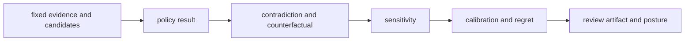

# Test strategy

Intelligence testing proves both the decision and its explanation under
ordinary, adverse, ambiguous, and changing conditions. Numeric movement alone
is not sufficient evidence.

## Evidence layers

| Layer | Question | Representative suite |
| --- | --- | --- |
| candidate integrity | are valid, invalid, missing, duplicate, excluded, and fingerprinted candidates handled explicitly? | `tests/candidates/` |
| component semantics | do orientation, scale, boundaries, missingness, and explanations agree? | candidate ranking and quality tests |
| policy behavior | are constraints, weights, thresholds, ties, alternatives, and order deterministic? | judgment policy and decision tests |
| challenge | do contradictions, falsifiers, counterfactuals, blinded cases, and skeptical posture affect the result? | contradictions, falsifiers, judgment challenge, and posture tests |
| stability | which plausible evidence, threshold, weight, or scenario changes reverse or weaken the action? | sensitivity and scenario tests |
| calibration and regret | does declared confidence match the corpus and are alternative costs retained? | confidence, calibration, and regret tests |
| review artifact | can a reader reconstruct evidence, candidates, policy, challenges, posture, and authority? | `tests/reviews/` |
| learning | does outcome feedback create a versioned policy without rewriting history? | `tests/learning/` |
| package boundary | are Foundation, Core, Knowledge, Runtime, and Lab meanings preserved? | `tests/package/` |

## Decision challenge path



Run the closest decision family first, then the complete suite when public
policy, candidate models, review artifacts, or cross-package contracts move:

```bash
uv run --project packages/bijux-proteomics-intelligence \
  pytest -q packages/bijux-proteomics-intelligence/tests
```

## Required negative outcomes

Test no candidate, tied candidates, contradictory evidence, missing
decision-critical evidence, unstable recommendation, calibration outside the
supported corpus, excessive regret, and absent downstream authority. Hold and
refusal are successful test outcomes when their preconditions are met.

Snapshotting a recommendation sentence does not prove the policy. Assert the
candidate set, component results, alternatives, challenge findings, posture,
and authority record that explain it.
