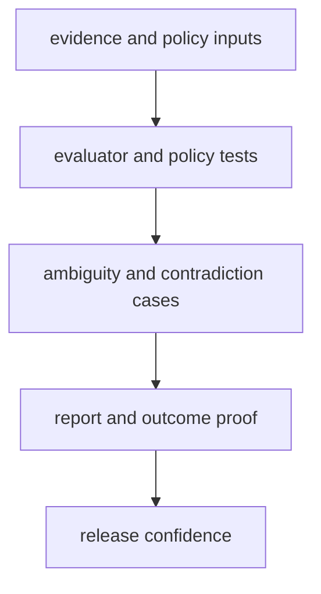

# Test Strategy

A useful test strategy names what evidence is needed and why shallow coverage is not enough.

For `bijux-proteomics-intelligence`, the test story should show how recommendation logic remains explainable under ambiguity, contradiction, and changed outcome paths.

## Strategy Model

The point is not simply to prove that scores move. The strategy has to show why a recommendation changed and whether that explanation survives all the way to the published outputs.

## Review Rules

- favor tests that show why an outcome changed, not just that it changed
- cover ambiguity, contradiction, and decision-loop pressure cases
- treat report artifacts as quality surfaces, not optional extras

## First Proof Check

- `packages/bijux-proteomics-intelligence/tests`
- `src/bijux_proteomics_intelligence/policies.py` and `evaluators.py`
- `src/bijux_proteomics_intelligence/report/` and `outcomes.py`

## Design Pressure

The easy failure is a test suite that proves numeric movement while leaving the explanation path too thin for a reviewer to trust.
