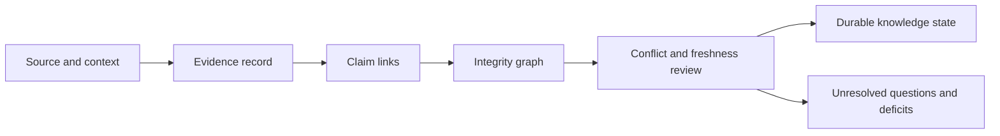

# Architecture Risks

Knowledge fails when evidence remains storable but loses the context needed to judge what it supports, contradicts, or cannot resolve.

| Risk | Consequence | Control |
| --- | --- | --- |
| Source flattening | Literature, lab observation, model inference, import, and curation appear equivalent | Preserve source type, origin, extraction method, and provenance |
| Context collapse | Evidence from different species, tissues, conditions, doses, or modalities is combined | Evaluate context compatibility and split conflicts when necessary |
| Duplicate support | Correlated or replicated records inflate trust | Track identity, overlap, and triangulation independence |
| Contradiction erasure | Preferred evidence overwrites the losing record | Retain both records plus an attributed resolution |
| Confidence drift | The same numeric confidence acquires changing meaning | Bind confidence to policy, components, and review record |
| Staleness blindness | Old evidence remains “supported” after reference or freshness boundaries move | Persist observation time, reference release, and freshness state |
| Identifier over-resolution | Ambiguous biological mappings are forced to one entity | Preserve unresolved, ambiguous, and multi-match status |
| Graph corruption | Claims reference absent evidence or decision paths become disconnected | Validate nodes, edges, and claim–evidence links |
| Decision contamination | A downstream recommendation rewrites what the evidence says | Keep recommendation policy outside evidence memory |

An evidence store is trustworthy only when absence, uncertainty, disagreement, and lineage survive normalization. More records do not compensate for weaker context.

## Audit one claim under pressure

| Review pass | Question | Refusal condition |
| --- | --- | --- |
| source | can every record be opened at the identified version and traced to its extraction? | missing, mutable, or unverifiable source identity |
| subject | do identifiers resolve without forcing an unsupported biological mapping? | unresolved or material ambiguity hidden by normalization |
| context | are organism, tissue, condition, assay, cohort, and analytical settings compatible with the claim? | required context absent or materially incompatible |
| relationship | does each record support, contradict, qualify, contextualize, or fail to resolve the precise proposition? | relationship inferred from co-occurrence or citation alone |
| independence | are repeated, derived, or shared-source observations prevented from inflating support? | support burden depends on correlated evidence presented as independent |
| freshness | do source releases and observations satisfy the declared use-specific policy? | expired evidence is necessary for the conclusion without explicit downgrade |
| sufficiency | does the surviving bundle meet the burden for the intended descriptive, prioritization, or experimental use? | stronger use is requested than the evidence bundle can support |

The audit may end with a supported, qualified, contradicted, unresolved, or
insufficient claim. Only the first two permit affirmative language, and both
remain bound to the reviewed subject, context, sources, and intended use.
