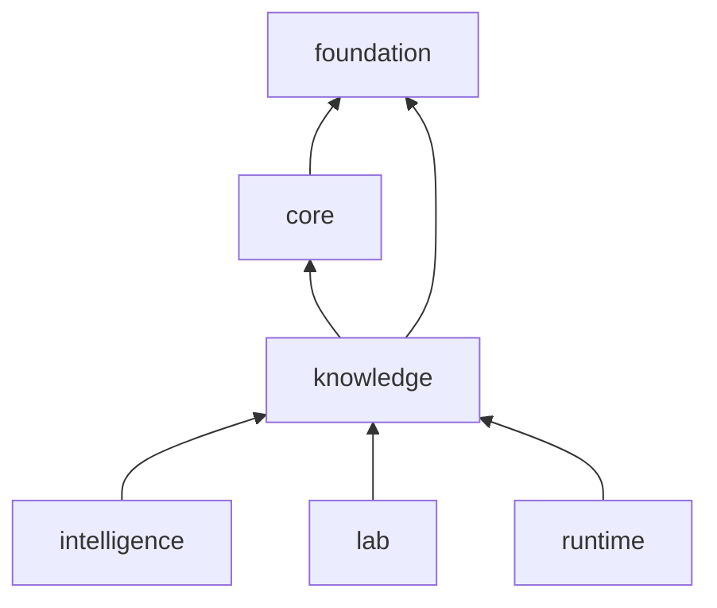

# Dependency Direction

Knowledge depends on foundation for stable contracts and on core for shared scientific annotations. Intelligence, lab, and runtime consume knowledge outputs; knowledge must not depend on their policy or operational state.

## Import rules

- Memory models build on foundation identity and serialization semantics.
- Biological resolvers may use core scientific contracts and annotation representations, but their resolved records remain knowledge-owned.
- Review views depend on memory and resolution outputs, not the reverse.
- Intelligence policy, candidate scoring, lab readiness, service state, and artifact orchestration stay downstream.
- Pydantic is the only non-Bijux required dependency; source-specific clients or network access are not hidden requirements of the core package.

## Data authority

A typed resolver makes an external assertion usable; it does not make that assertion timeless or universally authoritative. Resolved entries retain source identity, status, ambiguity, and coverage information so consumers can decide whether the evidence is fit for a particular question. The same protein may legitimately have different pathway, complex, disease, ortholog, or drug relationships under different references or releases.

## Separating memory from judgment

Evidence quality and contradiction belong in knowledge because they describe the state of support. A recommendation belongs in intelligence because it applies a decision policy to that state. Keeping the edge one-way means evidence can be re-evaluated under a new policy without rewriting history, and a policy change cannot silently alter stored source records.

Storage is likewise an adapter concern. Repositories may persist bundles and reports, but database layout, process lifecycle, and service availability do not determine the meaning of a claim.
