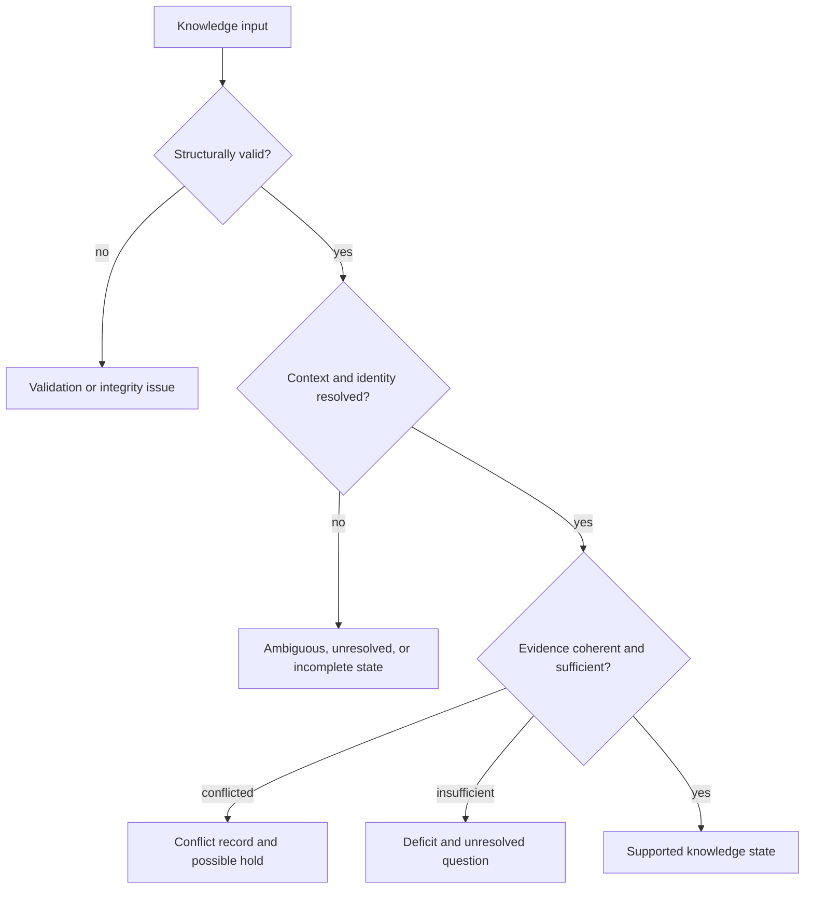

# Error Model

Knowledge represents many scientifically important problems as typed states or issues rather than process failures. An unresolved identifier or contradicted claim may be valid knowledge even though it cannot support a decision.

| Condition | Representation | Meaning |
| --- | --- | --- |
| Invalid record | Quantitative, bundle-integrity, claim-validation, or graph issue | The contract or relationship is structurally unsound |
| Schema mismatch | Compatibility report | Stored and expected knowledge shapes require assessment or migration |
| Unresolved identity | Resolver status and row-level entry | No supported mapping was established |
| Ambiguous identity | Multiple candidates or ambiguity state | More than one mapping remains plausible |
| Incomplete context | Context-completeness report | Required species, system, assay, condition, or scale information is absent |
| Stale evidence | Freshness state or literature audit | Evidence no longer satisfies the active age or reference policy |
| Contradiction | Contradiction state, cluster, or disagreement report | Credible records disagree under comparable context |
| Insufficient support | Sufficiency state or knowledge-deficit report | Evidence is valid but inadequate for the requested claim strength |
| Reconciliation hold | Resolution summary | Policy requires curation or more evidence before preference |

The package must not turn these states into missing rows, empty strings, or generic exceptions. Downstream consumers need to distinguish “not found,” “not mapped,” “mapped ambiguously,” “contradicted,” “stale,” and “not sufficient.”

## Preserve the resolving action

| Knowledge state | Consumer response | Closure evidence |
| --- | --- | --- |
| not found | record the searched source, release, query, and coverage boundary | a later source version or expanded search with a distinct result identity |
| unresolved identity | retain the source value and attempted resolver paths | a supported mapping rule, curated decision, or explicit unresolvable disposition |
| ambiguous identity | keep all plausible matches and prevent singular downstream claims | discriminating evidence or a multi-entity claim that preserves ambiguity |
| incomplete context | restrict use to context-independent questions or hold the claim | supplied organism, tissue, condition, assay, scale, or other named context |
| stale evidence | exclude or downgrade according to freshness policy | refreshed source identity and a new relationship assessment |
| contradiction | preserve both sides and compare context, quality, and independence | attributed reconciliation, qualified claim, or unresolved conflict |
| insufficient support | narrow the intended use or obtain the named evidence burden | new sufficiency decision over an identified evidence bundle |
| integrity failure | stop projection and repair the graph or bundle | successful integrity validation over the corrected durable records |

Closure always creates or references a new record. Editing the original source,
dropping the losing relationship, or replacing absence with a default value
destroys the evidence needed to explain the resolution.
