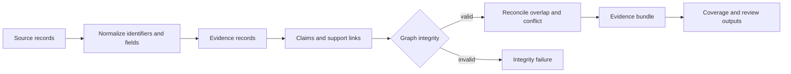
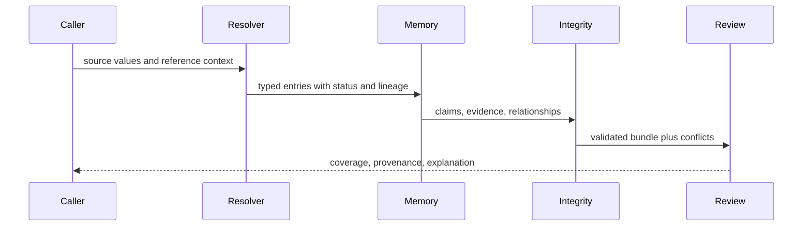

# Execution Model

Knowledge processing is an evidence-preserving pipeline. Source material is normalized into records and claims, linked into a validated graph, reconciled without erasing disagreement, and projected into coverage and review outputs.

## Ingestion and identity

Normalization establishes stable identifiers, schema shape, source lineage, and comparable values before records enter memory. Biological resolvers expose status and ambiguity explicitly: unresolved and multiply resolved identifiers remain visible outcomes rather than disappearing from a join.

## Graph and reconciliation

Claims point to supporting or challenging evidence. Integrity validation checks that referenced nodes exist and that the graph remains structurally coherent. Reconciliation groups overlapping assertions, records contradictions, and creates a resolution account where policy permits one. It does not overwrite an adverse record merely because another source is preferred.

## Durable outputs

Resolution reports pair row-level entries with summaries, and TSV renderers provide stable, reviewable interchange. Evidence bundles retain source and schema context. Decision briefs, trends, and explanations are derived views and should be regenerable from the retained knowledge state.

Failures distinguish malformed input, schema incompatibility, unresolved identity, incomplete coverage, and graph inconsistency. None of these should be collapsed into “no result”: absence, ambiguity, conflict, and invalidity have different scientific consequences for downstream judgment.
