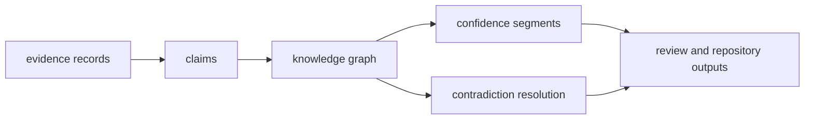

# Architecture

`bijux-proteomics-knowledge` architecture is about keeping evidence usable even
when sources disagree. This section should help a reader see how claims, graphs,
confidence, contradiction handling, and review outputs fit together without
collapsing into recommendation policy or generic storage plumbing.

## Architectural Promise

- contradictory evidence should become inspectable structure, not silent data
  loss
- trust scoring and contradiction handling should remain close to the claims
  they justify
- repository boundaries should preserve the reasoning trail, not just the final
  answer

## Start With

- open [Execution Model](https://bijux.io/bijux-proteomics/06-bijux-proteomics-knowledge/architecture/execution-model/)
  when the question is how raw evidence becomes reviewable knowledge
- open [Integration Seams](https://bijux.io/bijux-proteomics/06-bijux-proteomics-knowledge/architecture/integration-seams/)
  when a change starts to blur knowledge work with recommendation policy or
  generic persistence concerns
- open [Module Map](https://bijux.io/bijux-proteomics/06-bijux-proteomics-knowledge/architecture/module-map/)
  when you need the owner for claims, graphs, confidence, or resolution code

## Read By Tension

- when evidence volume grows:
  [State and Persistence](https://bijux.io/bijux-proteomics/06-bijux-proteomics-knowledge/architecture/state-and-persistence/)
  and [Dependency Direction](https://bijux.io/bijux-proteomics/06-bijux-proteomics-knowledge/architecture/dependency-direction/)
- when contradictions grow:
  [Error Model](https://bijux.io/bijux-proteomics/06-bijux-proteomics-knowledge/architecture/error-model/)
  and [Architecture Risks](https://bijux.io/bijux-proteomics/06-bijux-proteomics-knowledge/architecture/architecture-risks/)
- when new source or resolution logic is proposed:
  [Extensibility Model](https://bijux.io/bijux-proteomics/06-bijux-proteomics-knowledge/architecture/extensibility-model/)
  and [Code Navigation](https://bijux.io/bijux-proteomics/06-bijux-proteomics-knowledge/architecture/code-navigation/)

## First Proof Check

- `src/bijux_proteomics_knowledge/memory/models/claims.py`, `memory/models/evidence.py`, and `memory/integrity/graph.py` for canonical knowledge structures
- `src/bijux_proteomics_knowledge/memory/reconciliation/resolution.py`, `reviews/decision_briefs.py`, and `reviews/provenance.py` for trust and contradiction handling
- `src/bijux_proteomics_knowledge/contracts/schema.py`, `references/public.py`, and `reviews/trends.py` for durable boundaries

## Boundary Test

If the architecture can show a final conclusion but not the path through
conflict and confidence, it is hiding the most important part of the package.
