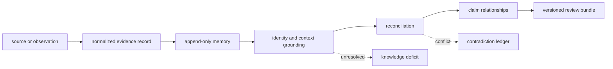
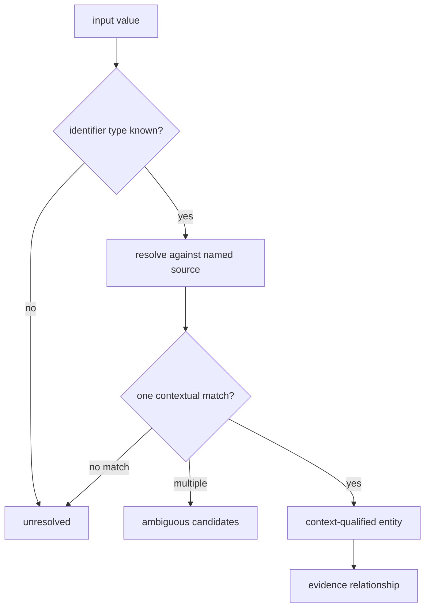

# Evidence architecture

`bijux-proteomics-knowledge` separates evidence custody from biological
grounding and review. Evidence memory preserves what a source said and under
which context. Grounding resolves identifiers and biological relationships.
Reconciliation records agreement, contradiction, qualification, and unresolved
gaps. Review artifacts summarize that state without becoming a second source
of truth.

## Responsibility map

| Family | Owns | Preserves explicitly |
| --- | --- | --- |
| `memory.models` | evidence, claims, bundles, relationships, status | observation versus inference, source identity, context |
| `memory.normalization` | stable ingestion and canonical form | original lineage and transformation rule |
| `memory.integrity` | graph validation and referential integrity | missing nodes, invalid edges, orphaned evidence |
| `memory.reconciliation` | duplicate and conflict resolution | competing records, selected action, hold state |
| `identity`, `features`, `pathways`, `complexes` | entity and biological-context resolution | source, coverage, ambiguity, unresolved identifiers |
| `kinases`, `disease`, `drugs`, `orthologs` | specialized relationship resolution | organism, evidence status, contextual limits |
| `references.grounding` | citations, literature, ontologies, corpora, context | retrieval and source limitations |
| `references.workflows` | audits, deficits, contradictions, sufficiency, reading packs | claim-to-evidence lineage and review posture |
| `reviews` | decision briefs, explanations, provenance | unresolved and contradicting evidence |

The [module map](module-map.md) identifies the exact owner modules and
[dependency direction](dependency-direction.md) protects the flow between them.

## Identity before interpretation

Grounding is a sequence of explicit decisions:

A syntactically valid accession is not yet a grounded biological entity. The
resolution source, version, organism, feature coordinates, aliases, and
relationship evidence determine whether the match is usable for the intended
claim.

## Memory and review state

Evidence memory is append-only in meaning. Corrections and superseding records
retain their lineage; they do not erase the state used by an earlier review or
recommendation. Review bundles identify the memory revision and policy under
which they were assembled.

[State and persistence](state-and-persistence.md) defines record and graph
custody. [Execution model](execution-model.md) explains normalization,
grounding, reconciliation, and review as domain operations rather than a
long-running service lifecycle.

## Contradiction is structure

Two sources can conflict because they assert incompatible propositions, use
different biological contexts, apply different methods, or resolve identity
differently. Reconciliation classifies that relationship and records the
policy action: retain both, split context, prefer one under a declared rule,
request curation, or hold the claim.

The architecture never treats absence as automatic negative evidence and never
turns a contradiction into a recommendation. Intelligence decides how a
versioned evidence posture affects an action.

## Extension rules

A new source connector owns faithful ingestion and provenance. A new resolver
owns identifier and context rules. A new review workflow composes existing
evidence without mutating it. Extensions require fixtures for ambiguous,
unresolved, stale, contradictory, and malformed cases—not only successful
resolution.

Use [extensibility model](extensibility-model.md) for adding sources and
resolvers, [integration seams](integration-seams.md) for cross-package
handoffs, and [error model](error-model.md) for typed unresolved and conflict
states.

## Architectural risks

The central risks are silent source replacement, loss of original context,
identifier over-resolution, duplicate evidence presented as independent
support, contradiction collapsed into one score, and decision policy leaking
into evidence state. [Architecture risks](architecture-risks.md) and
[code navigation](code-navigation.md) provide focused review routes.
