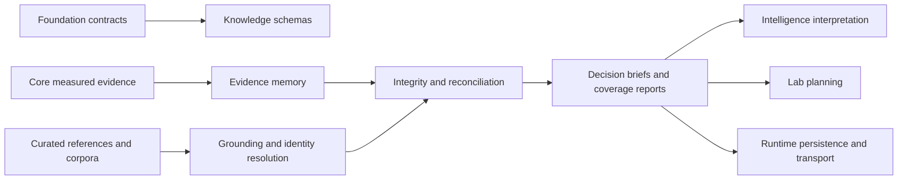

# Integration Seams

Knowledge integrates scientific observations with curated context without taking ownership of either measurement or downstream policy. Its contracts make provenance, ambiguity, contradiction, and coverage visible at every boundary.

## Producer and consumer obligations

| Seam | Producer must provide | Knowledge guarantees | Knowledge does not claim |
| --- | --- | --- | --- |
| Foundation → Knowledge | stable identifiers, serialization, provenance, compatibility, and outcome contracts | schema-aware knowledge artifacts built on shared primitives | ownership of cross-package primitives |
| Core → Knowledge | explicit measured evidence, units, entity identifiers, method context, and uncertainty | evidence records that retain origin and scope | reinterpretation of raw measurements or replacement of Core algorithms |
| Curated sources → Knowledge | source identity, version or retrieval context, citation, scope, and licensing-compatible metadata | separation of external references from bundled fixtures and deterministic normalization reports | live fetching, secret management, or source completeness |
| Knowledge → Intelligence | decision briefs, coverage, ambiguity, conflicts, and critical-claim provenance | reviewable context for advisory reasoning | ranking policy, causal certainty, or autonomous decisions |
| Knowledge → Lab | resolvable entities, biological context, readiness-relevant caveats, and provenance | bounded evidence packets for experimental planning | assay feasibility, operational readiness, or instrument control |
| Knowledge → Runtime | schema-labelled artifacts and deterministic renderings | stable semantics that survive persistence and transport | storage policy, retries, scheduling, or service lifecycle |

## Boundary invariants

Measured evidence remains owned by Core. Knowledge may normalize it into an evidence record and relate it to curated context, but it must preserve the source observation and its uncertainty. A curated association never upgrades a measurement by itself.

Ambiguity remains data. Protein aliases, cross-species orthologs, pathway membership, and indirect drug relationships can all produce more than one plausible interpretation. The resolver reports that state instead of selecting a convenient match silently.

Contradictions remain inspectable. Reconciliation may apply an explicit trust policy, but competing records and their provenance remain available to reviewers. A decision brief reports disagreement and can reduce readiness rather than manufacturing consensus.

Runtime is a carrier, not a semantic owner. Persisting a graph or transmitting a brief does not transfer authority over identity rules, evidence states, or curation policy. Intelligence and Lab consume the brief under their own charters; neither may erase its caveats.

## Changing a seam

A cross-package change requires the producer contract, Knowledge normalization or resolver, public export ledger, deterministic renderer, and consuming review path to agree. Validate older persisted artifacts through `contracts/schema.py`, and add a compatibility decision when the serialized shape changes. A seam is complete only when failure and ambiguity remain representable end to end.
