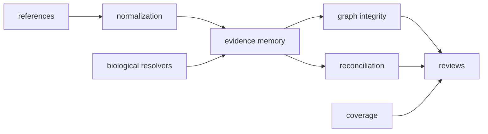

# Module Map

`bijux-proteomics-knowledge` is the evidence-memory and biological-grounding layer. It represents claims and their support, protects graph integrity, resolves external biological identifiers, and reports what the available knowledge does—and does not—cover.

## Evidence memory

`memory.models` defines `EvidenceRecord`, `EvidenceClaim`, and `EvidenceBundle`. Normalization turns incoming material into those contracts. Integrity code validates relationships among claims, evidence, and provenance. Reconciliation represents disagreement and resolution without deleting the conflicting source record.

## Biological grounding

| Family | Resolution surface |
| --- | --- |
| `identity` | Protein identifier resolution and status reporting |
| `pathways`, `complexes` | Membership resolution and confidence or coverage policy |
| `kinases` | Kinase–substrate relationships and match type |
| `drugs` | Drug–target relationships and relationship type |
| `disease` | Disease-term resolution |
| `orthologs` | Cross-species mapping, ambiguity, and evidence status |
| `features` | Protein feature intervals and overlap queries |
| `coverage` | Entity-set coverage reports under an explicit policy |

Each resolver returns typed entries, summaries, and reports, with stable TSV renderers for external review. The package root exposes these scientific contracts directly alongside the three memory models.

## Contracts and reviews

`contracts.schema` assesses schema compatibility at the knowledge boundary. `references` declares public reference material. `reviews` turns evidence state into decision briefs, explanations, provenance views, trends, and flagship-evidence records. These projections do not replace the underlying evidence bundle: they point back to it.

Knowledge records what sources assert and how those assertions connect. It does not rank program candidates, choose a laboratory action, or operate a service.
