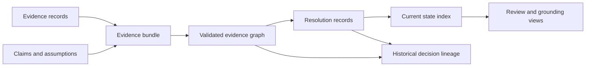

# State and Persistence

Knowledge memory is append-oriented and provenance-preserving. Current state can be projected for use, but the records and resolutions that produced it remain available for audit.

## Durable memory

- evidence records retain source URI, type, origin, extraction method, biological and experimental context, quantitative support, artifact flags, confidence, timestamps, and decision tags;
- claims retain structured statement, assumptions, supporting and contradicting evidence, status, polarity, confidence, resolution state, and proposed resolution assays;
- bundles retain document schema, target, records, trust, freshness, context, triangulation, coverage, and integrity findings;
- graphs retain targets, claims, evidence, decisions, assays, assumptions, questions, liabilities, and directed relations;
- reconciliation records retain compared evidence, action, policy, rationale, actor, time, and belief impact;
- biological grounding reports retain reference context, row-level status, ambiguity, coverage, and summaries.

## Mutation and projection

Source evidence is not edited merely to make the current claim state cleaner. Corrections and superseding sources create attributable records; reconciliation changes the current interpretation while preserving the prior conflict. Review briefs, coverage reports, and TSV exports are projections and should remain regenerable from durable memory.

The storage backend is not the authority. Whether records live in memory, files, or a service, their schema, identifiers, provenance, conflict history, and reference context determine their scientific meaning.

## Define a current projection

A “current” claim or evidence view is meaningful only when the projection is
reproducible from durable memory.

| Projection input | Required identity |
| --- | --- |
| evidence population | included and excluded record identities plus source releases |
| claim version | proposition, subject, context, granularity, and parent claim |
| relationship graph | support, contradiction, qualification, context-only, and unresolved edges |
| reconciliation policy | comparison rules, quality burden, context compatibility, and tie or hold behavior |
| freshness boundary | evaluation time, source-specific age policy, and expired records |
| curation state | attributed corrections, overrides, actors, rationale, and review time |
| output | projection identity, generated brief or index, limitations, and unresolved gaps |

Changing any input produces a new projection. Consumers may use a pointer to
the active projection, but citations and decision records must retain the exact
projection identity they consumed rather than following that mutable pointer
later.
