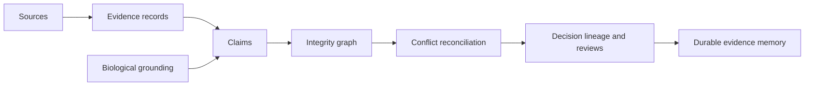

# Capability Map

`bijux-proteomics-knowledge` preserves scientific assertions, their sources, their conflicts, and their biological context. It makes evidence reusable without pretending that storage, normalization, or trust scoring settles every scientific disagreement.

## Memory capabilities

| Capability | Preserved context |
| --- | --- |
| Evidence records | kind, source, source type, origin, extraction method, assay context, quantitative support, artifacts, confidence, and time |
| Claims | statement, structured relation, assumptions, supporting and contradicting evidence, status, polarity, confidence, and resolution assays |
| Bundles | target-scoped evidence collections, document schema, decision tags, trust summaries, freshness, and conflict state |
| Integrity | valid claim-to-evidence links, graph coherence, duplicate and orphan detection |
| Reconciliation | policy, compared evidence, chosen action, rationale, belief update, actor, timestamp, and hold requirement |
| Query and lineage | structured filtering and traceability from decision areas to claims and evidence |

## Grounding capabilities

The package resolves protein identifiers, pathway and complex membership, kinase–substrate relationships, drug targets, disease terms, orthologs, and protein-feature overlaps. Every resolver carries status, ambiguity, coverage, or confidence rather than returning only matched values. Public reference workflows add citations, ontologies, literature audits, claim grounding, comparator confrontations, contradiction dossiers, and knowledge-deficit reports.

## Boundary

Knowledge can describe support and conflict and propose a governed reconciliation. It cannot choose a portfolio action, authorize an experiment, or execute a workflow. Intelligence applies decision policy; lab governs experimental action; runtime governs execution.
