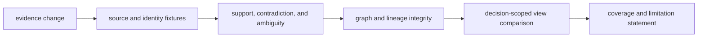

# Change Principles

Knowledge changes preserve the difference between a source, observation,
claim, relationship, resolution, and decision-scoped view. A change is safe
only when it keeps rejected, adverse, ambiguous, stale, and superseded evidence
reconstructable alongside the current projection.

## Classify the evidence change

| Changed surface | Questions to answer | Required evidence |
| --- | --- | --- |
| source adapter | Which release, fields, license, pagination, and rejection behavior changed? | source fixture, provenance, loss report, and failed records |
| identifier resolution | Which namespace, species, isoform, ambiguity, and precedence rules apply? | unique, ambiguous, unresolved, and wrong-context cases |
| evidence or claim model | Did relationship direction, uncertainty, context, or derivation meaning change? | round trip, invariant, and consumer interpretation proof |
| graph construction | Can order, duplicates, dangling edges, or unreachable records change the result? | deterministic build and hostile integrity corpus |
| trust or freshness policy | Which sources or claims change posture under the new rule? | policy identity, before/after audit, and boundary dates |
| contradiction detection | Which opposing records now cluster or escape review? | directional, contextual, shared-lineage, and quantitative conflicts |
| reconciliation | What evidence wins, loses, splits, or remains held, and why? | preview, resolution record, alternatives, and belief delta |
| coverage or sufficiency | What denominator and search scope define the gap? | represented, missing, unresolved, and unavailable source sets |
| decision brief | Does the rendered view still match canonical evidence? | fingerprint, regeneration, and downstream consumer proof |
| persisted schema | Can old evidence be read without changing meaning or losing history? | old/new fixtures, migration path, and explicit loss policy |

## Invariants

- source origin, version, retrieval, license, and derivation remain attached;
- biological identity never drops namespace, species, isoform, or ambiguity;
- relationship direction and context are explicit and tested asymmetrically;
- unresolved and rejected inputs survive ingestion reporting;
- contradiction resolution retains the losing evidence and rationale;
- confidence dimensions are not collapsed across source, claim, and decision;
- graph order does not alter the current projection;
- “no evidence found” names the search scope and unavailable sources; and
- new evidence supersedes rather than rewrites cited history.

Review downstream briefs and decisions whenever a change can alter support,
contradiction, freshness, coverage, or sufficiency. If the affected consumer
has not been evaluated, report local evidence-contract proof and leave the
broader decision consequence unresolved.
