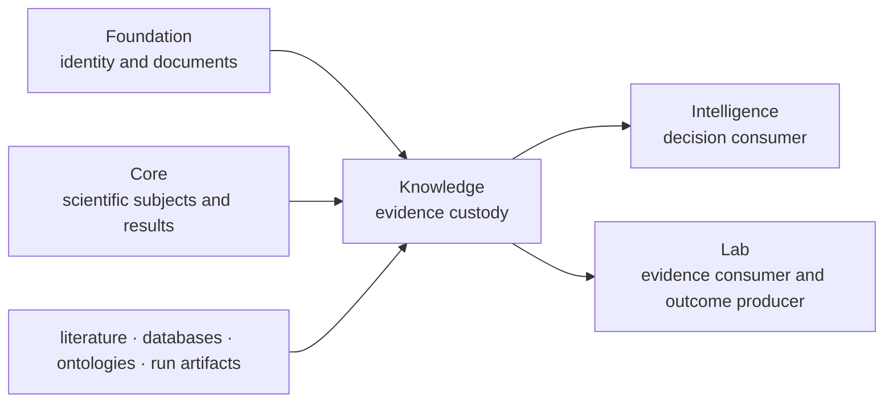

# Dependencies and adjacencies

Knowledge is downstream of shared document contracts and scientific identity,
but upstream of recommendation policy. Published metadata declares Foundation
and Core as product prerequisites. The current Knowledge source tree imports
Foundation contracts directly; it keeps Core as the neighboring scientific
authority rather than importing scientific algorithms into evidence custody.

The arrows into Knowledge describe prerequisites or evidence inputs. The arrows
out describe record handoffs, not dependencies that grant downstream packages
permission to modify evidence history.

## Dependency contract

| Dependency | Knowledge use | Boundary |
| --- | --- | --- |
| Foundation | `JsonModel`, identifiers, document schemas, fingerprints, typed outcomes | canonical representation does not decide evidential truth |
| Core | declared scientific-semantic neighbor for proteins, features, pathways, and workflow results | calculations and scientific acceptance remain Core-owned |
| Pydantic | strict evidence, claim, resolution, and review records | validation cannot manufacture provenance or context |
| external sources | observations, assertions, identifiers, and reference relationships | retrieval success and source reputation are not support by themselves |

## Downstream adjacencies

| Consumer | Knowledge supplies | Consumer may add | Consumer may not change |
| --- | --- | --- | --- |
| Intelligence | versioned evidence bundle, support, contradiction, gaps, sufficiency posture | ranking policy, scenarios, sensitivity, recommendation, refusal | source content, relationship, provenance, or historical resolution |
| Lab | evidence context for assay design and readiness | plan, handoff, observation, QC, consequence | the evidence bundle that justified the original request |
| Runtime | portable review input or artifact reference | execution identity and custody | evidence meaning or contradiction state |

Lab observations return through an explicit ingestion route and become new
evidence records. They do not edit the recommendation or evidence snapshot that
preceded the experiment.

## Dependency placement rules

Add a dependency only when it protects evidence meaning or a public handoff.
Reject it when it imports a downstream decision or operational policy into the
memory layer.

| Proposed need | Placement |
| --- | --- |
| canonical evidence and claim documents | Foundation contract plus Knowledge model |
| protein, feature, or pathway scientific meaning | Core-owned contract referenced by Knowledge |
| source retrieval or ontology adapter | Knowledge reference boundary with version and provenance |
| candidate ranking or next-action choice | Intelligence |
| execution retry, provider, or artifact transport | Runtime |
| scheduling, readiness, or outcome acceptance | Lab |

## Review the edge

Before accepting a dependency change, verify that:

1. evidence records remain loadable without importing a downstream policy
   package;
2. source version, biological context, analytical context, and lineage remain
   explicit;
3. missing or conflicting evidence produces a gap or contradiction rather than
   a guessed value;
4. a downstream consumer receives immutable record identities;
5. the edge does not create a circular path through decision or laboratory
   state.

Continue with [evidence foundations](package-overview.md),
[architecture](../architecture/index.md), and
[dependency governance](../quality/dependency-governance.md).
