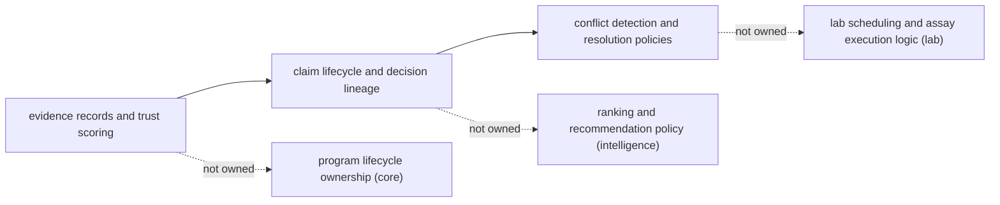

# Foundation

This section explains why `bijux-proteomics-knowledge` exists, what it owns on purpose, and where its boundary stops.

Read this section first when you need the durable package story before code detail. A quick skim should make the role, the boundary, and the neighboring seams legible.

Treat the foundation pages for `bijux-proteomics-knowledge` as the package's durable self-description. If the package still feels blurry after this section, the boundary story is not clear enough yet.

## Visual Summary

## Pages in This Section

- [Package Overview](package-overview.md)
- [Scope and Non-Goals](scope-and-non-goals.md)
- [Ownership Boundary](ownership-boundary.md)
- [Repository Fit](repository-fit.md)
- [Capability Map](capability-map.md)
- [Domain Language](domain-language.md)
- [Lifecycle Overview](lifecycle-overview.md)
- [Dependencies and Adjacencies](dependencies-and-adjacencies.md)
- [Change Principles](change-principles.md)

## Read Across the Package

- [Architecture](../architecture/index.md) when the question becomes structural, modular, or execution-oriented
- [Interfaces](../interfaces/index.md) when the question becomes caller-facing, schema-facing, or contract-facing
- [Operations](../operations/index.md) when the question becomes procedural, environmental, diagnostic, or release-oriented
- [Quality](../quality/index.md) when the question becomes proof, risk, trust, or review sufficiency

## Concrete Anchors

- `packages/bijux-proteomics-knowledge` as the package root
- `packages/bijux-proteomics-knowledge/src/bijux_proteomics_knowledge` as the import boundary
- `packages/bijux-proteomics-knowledge/tests` as the package proof surface

## Use This Page When

- you need the package idea before the implementation detail
- you are deciding whether work belongs here or in a neighboring package
- you want the shortest honest explanation of what this package is for

## Decision Rule

Use `Foundation` to decide whether a change makes `bijux-proteomics-knowledge` easier or harder to defend as one distinct role in the overall system. If the work makes the package broader without making its role clearer, stop and re-check the boundary before treating the change as a local improvement.

## What This Page Answers

- what problem `bijux-proteomics-knowledge` is supposed to own on purpose
- where the package boundary stops, even when nearby code looks tempting
- which neighboring package seams deserve comparison before changing ownership

## Reviewer Lens

- compare the stated boundary with the modules, artifacts, and tests that are supposed to uphold it
- check that out-of-scope behavior is not quietly re-entering through convenience paths
- confirm that the package story still matches the real repository layout and neighboring package docs

## Honesty Boundary

This page can explain the intended boundary of `bijux-proteomics-knowledge`, but it cannot prove that boundary by itself. The real proof still lives in the code, tests, and neighboring package seams that either support or contradict the story told here.

## Next Checks

- move to architecture when the question becomes structural rather than boundary-oriented
- move to interfaces when the question becomes contract-facing
- move to quality when the question becomes proof or review sufficiency

## Purpose

This page explains how to use the foundation section for `bijux-proteomics-knowledge` without repeating the detail that belongs on the topic pages beneath it.

## Stability

This page is part of the canonical package docs spine. Keep it aligned with the current package boundary and the topic pages in this section.
