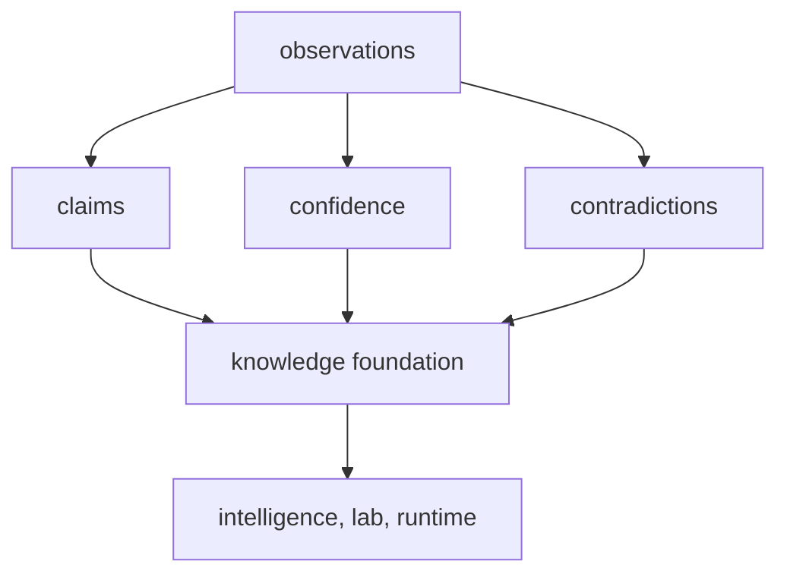

# Foundation

The foundation section explains the durable role of `bijux-proteomics-knowledge` before it
explains implementation detail. Use it to resolve why evidence truth belongs here before decision or lab layers consume it.

That role is materially richer now than a general evidence ledger. Stronger
workflow packets, public trust surfaces, and downstream recommendation pressure
mean this section has to own exact grounding, contradiction discipline,
literature audit routes, and biological context with enough clarity that the
rest of the repository cannot improvise why a sentence should be believed.

## What This Section Protects

- a stable place for truth claims before they become decisions
- contradiction as structured information instead of something to hide
- confidence semantics that downstream packages can consume without redefining

## What This Section Now Carries

- claim grounding that ties public language back to named evidence owners
- contradiction and confidence routes that keep hesitation visible
- literature and biological review surfaces that prevent downstream packages
  from inventing scientific memory

## Start With

- Open [Package Overview](https://bijux.io/bijux-proteomics/06-bijux-proteomics-knowledge/foundation/package-overview/) for the shortest statement of
  the package role.
- Open [Ownership Boundary](https://bijux.io/bijux-proteomics/06-bijux-proteomics-knowledge/foundation/ownership-boundary/) when the question is
  whether a change belongs here or in a neighbor.
- Open [Scope and Non-Goals](https://bijux.io/bijux-proteomics/06-bijux-proteomics-knowledge/foundation/scope-and-non-goals/) when a proposed change
  risks broadening the package.
- Open [Capability Map](https://bijux.io/bijux-proteomics/06-bijux-proteomics-knowledge/foundation/capability-map/) when you need the concrete work
  the package is allowed to do.
- Open [This Package Does Not Own](https://bijux.io/bijux-proteomics/06-bijux-proteomics-knowledge/this-package-does-not-own/)
  when a proposal is trying to turn evidence state into recommendation policy,
  workflow law, or runtime behavior.
- Open [Workflow Claim Grounding](https://bijux.io/bijux-proteomics/06-bijux-proteomics-knowledge/foundation/workflow-claim-grounding/)
  when the question is whether public trust language is actually tied to exact evidence owners.
- Open [Workflow Literature Audits](https://bijux.io/bijux-proteomics/06-bijux-proteomics-knowledge/foundation/workflow-literature-audits/)
  when the question is whether the shipped citations, bibliography, or gap stories are still current enough.

## Section Pages

- [Package Overview](https://bijux.io/bijux-proteomics/06-bijux-proteomics-knowledge/foundation/package-overview/)
- [Scope and Non-Goals](https://bijux.io/bijux-proteomics/06-bijux-proteomics-knowledge/foundation/scope-and-non-goals/)
- [Ownership Boundary](https://bijux.io/bijux-proteomics/06-bijux-proteomics-knowledge/foundation/ownership-boundary/)
- [This Package Does Not Own](https://bijux.io/bijux-proteomics/06-bijux-proteomics-knowledge/this-package-does-not-own/)
- [Capability Map](https://bijux.io/bijux-proteomics/06-bijux-proteomics-knowledge/foundation/capability-map/)
- [Workflow Claim Grounding](https://bijux.io/bijux-proteomics/06-bijux-proteomics-knowledge/foundation/workflow-claim-grounding/)
- [Workflow Literature Audits](https://bijux.io/bijux-proteomics/06-bijux-proteomics-knowledge/foundation/workflow-literature-audits/)
- [Dependencies and Adjacencies](https://bijux.io/bijux-proteomics/06-bijux-proteomics-knowledge/foundation/dependencies-and-adjacencies/)
- [Repository Fit](https://bijux.io/bijux-proteomics/06-bijux-proteomics-knowledge/foundation/repository-fit/)
- [Lifecycle Overview](https://bijux.io/bijux-proteomics/06-bijux-proteomics-knowledge/foundation/lifecycle-overview/)
- [Domain Language](https://bijux.io/bijux-proteomics/06-bijux-proteomics-knowledge/foundation/domain-language/)
- [Change Principles](https://bijux.io/bijux-proteomics/06-bijux-proteomics-knowledge/foundation/change-principles/)

## What This Section Settles

- when a change is really about evidence state rather than about downstream use
- how confidence and contradiction should remain explicit
- when a proposed change belongs in intelligence, lab, or runtime instead of
  here

## Strongest Knowledge Proof

- start with
  [Workflow Claim Grounding](https://bijux.io/bijux-proteomics/06-bijux-proteomics-knowledge/foundation/workflow-claim-grounding/)
  when the real question is whether a trust sentence is grounded precisely
- continue to
  [Workflow Literature Audits](https://bijux.io/bijux-proteomics/06-bijux-proteomics-knowledge/foundation/workflow-literature-audits/)
  when the dispute is whether the cited scientific backdrop is still honest and
  current
- open
  [This Package Does Not Own](https://bijux.io/bijux-proteomics/06-bijux-proteomics-knowledge/this-package-does-not-own/)
  when someone is trying to convert evidence state into recommendation posture
  or operator control

## First Proof Check

- `packages/bijux-proteomics-knowledge/src/bijux_proteomics_knowledge`
- `packages/bijux-proteomics-knowledge/tests`
- neighboring handbooks once the change crosses the local boundary

## Neighbors

- Open [bijux-proteomics-intelligence](https://bijux.io/bijux-proteomics/05-bijux-proteomics-intelligence/)
  when the question leaves claims, confidence, contradictions, and evidence state.
- Open [bijux-proteomics-lab](https://bijux.io/bijux-proteomics/07-bijux-proteomics-lab/)
  when the issue is clearly outside this package's local role.
