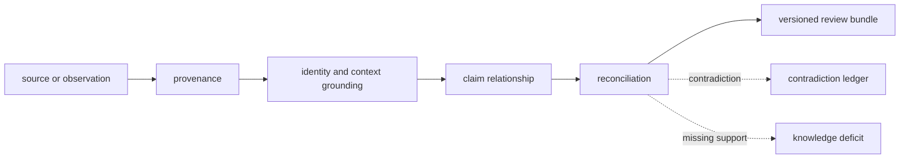
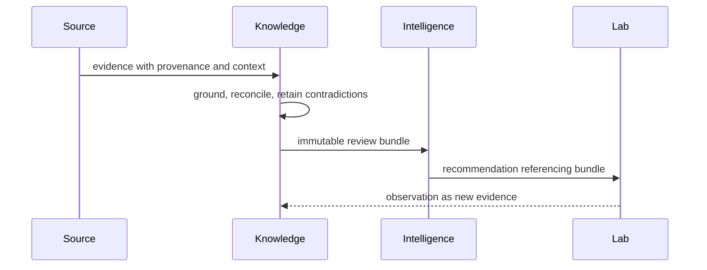

# Evidence foundations

Knowledge owns the durable relationship between a claim and the evidence that
supports, contradicts, qualifies, or fails to resolve it. Its memory preserves
source identity, biological context, provenance, confidence, and history before
Intelligence applies decision policy or Lab adds experimental consequence.

## Evidence routes

| Question | Guide | Governing evidence |
| --- | --- | --- |
| What does Knowledge own? | [Package overview](package-overview.md) | memory, grounding, reconciliation, and review bundles |
| Does a record belong here? | [Ownership boundary](ownership-boundary.md) | evidence state rather than downstream policy |
| Which biological and review capabilities exist? | [Capability map](capability-map.md) | typed resolvers, evidence memory, references, and audits |
| What must remain outside? | [Scope and non-goals](scope-and-non-goals.md) | algorithm ownership, ranking, execution, and lab authority |
| Is public language grounded? | [Workflow claim grounding](workflow-claim-grounding.md) | exact source, context, support, and contradiction chain |
| Is the scientific backdrop current? | [Workflow literature audits](workflow-literature-audits.md) | bibliography, corpus, gap, and freshness record |

[This package does not own](../this-package-does-not-own.md) resolves boundary
cases where evidence state is being confused with a recommendation or an
operational result.

## Evidence protocol

1. Identify the source, version, retrieval context, and applicable license.
2. Normalize the record without losing the original source identity.
3. Resolve biological identifiers and contextual qualifiers explicitly.
4. Attach the record to a precise proposition as support, contradiction,
   qualification, mention, or unresolved material.
5. Reconcile duplicates and conflicts without discarding independent lineage.
6. Assess coverage, directness, quality, freshness, and intended-use
   sufficiency.
7. Produce a versioned review bundle that retains support, contradiction, and
   deficits.

The loop appends knowledge. It never allows a later outcome to rewrite the
source and evidence available to an earlier decision.

## Grounding dimensions

Biological grounding is multidimensional. The package exposes resolution for
protein identifiers, features, pathways, complexes, kinase–substrate
relationships, diseases, drug targets, and orthologs. A successful match in one
dimension does not settle the others.

For example, an identifier may resolve while the species is wrong; a feature
may overlap while the experimental condition differs; a pathway membership may
be correct while coverage is too sparse for the intended conclusion. Review
bundles retain these distinctions instead of flattening them into one score.

## Contradiction and sufficiency

Contradiction is a first-class relationship, not a failed ingestion. A review
can contain strong support and strong contradiction simultaneously. Confidence
describes the current evidence posture under declared context; it is not a
ranking score and does not authorize an action.

Evidence sufficiency is always relative to intended use:

| Intended use | Typical burden |
| --- | --- |
| descriptive context | resolved identity, source provenance, and relevant context |
| scientific interpretation | multiple relevant records, limitations, contradictions, and coverage assessment |
| candidate prioritization | versioned review bundle suitable for declared decision policy |
| experimental action | decision record plus Lab feasibility, risk, and readiness review |

Missing evidence remains a knowledge deficit. It is not automatically negative
evidence, and it cannot be converted into support by confident prose.

## Evolution rules

The [domain language](domain-language.md) stabilizes claim, evidence, source,
context, grounding, contradiction, and sufficiency. The
[change principles](change-principles.md) preserve source lineage and review
history when schemas or resolution policy evolve. [Dependencies and adjacencies](dependencies-and-adjacencies.md)
and [repository fit](repository-fit.md) keep the package independent of
Intelligence, Runtime, and Lab, while [lifecycle overview](lifecycle-overview.md)
defines how evidence moves from ingestion to reviewed memory.
