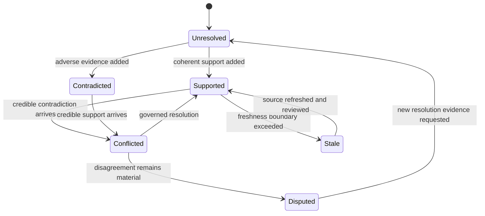
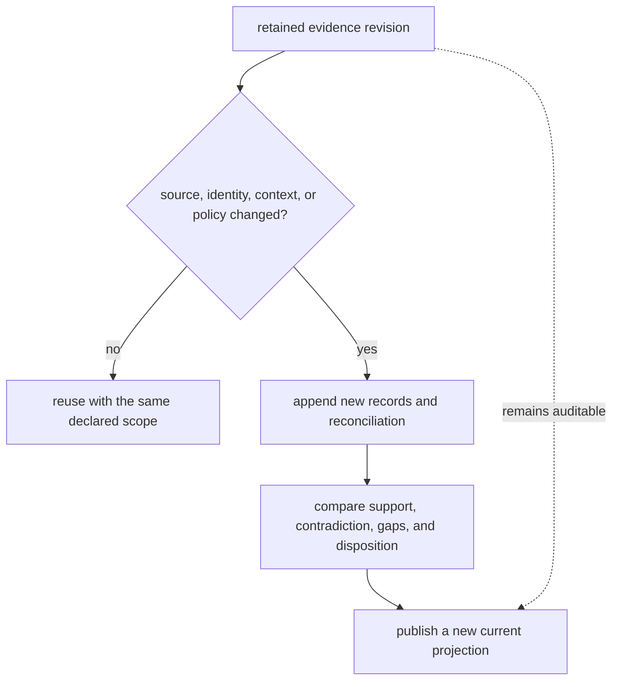

# Lifecycle Overview

Knowledge evolves by appending and reconciling evidence, not by replacing inconvenient history. Claims can gain support, become disputed, go stale, remain insufficient, or be split by context as new records arrive.

## Evidence lifecycle

Ingestion records origin—observed, inferred, imported, or synthetic—and extraction method—manual curation, automated import, model inference, or lab capture. Quantitative support retains intervals, variance, replicate and peptide counts, localization probability, censoring, scale, and units. Artifact flags keep missing-not-at-random behavior, interference, protein ambiguity, and localization uncertainty visible.

Claims link supporting and contradicting evidence separately. Their status, evidence state, confidence, assumptions, decision impact, and proposed resolution assays can change while source records remain intact. Decision lineage connects later use back to both favorable and disputed claims.

## Conflict lifecycle

Reconciliation evaluates source precedence, confidence difference, severity, context, and modality under a named policy. Possible actions include accepting higher-trust evidence, requiring curation, holding a decision, or splitting by context or modality. Each resolution records rationale, actor, time, and its effect on claim belief.

A resolved conflict is not deleted. It remains available for audit and can be revisited when a source is corrected, a reference release changes, or new evidence alters the balance.

## Evidence dossier by state

| State | Required contents | Permitted disposition |
| --- | --- | --- |
| unresolved | input identifier, namespace, organism, context, source, and attempted resolution paths | resolve, split, or retain unresolved |
| supported | exact claim, contextual support, provenance, uncertainty, independence, freshness, and coverage | publish bounded support or continue review |
| contradicted | exact adverse relationship, context, source quality, and decision impact | publish contradiction, split context, or escalate |
| conflicted | competing records, shared lineage, context comparison, severity, and reconciliation policy | accept, split, hold, or require curation |
| disputed | unresolved competing interpretations, responsible reviewer, and evidence needed to close | remain visible and block affected decisions |
| stale | source version, retrieval time, freshness policy, and affected claims | refresh, supersede, or narrow the evidence posture |
| superseded | replacement record or review, rationale, and lineage to the previous state | remain immutable for historical reconstruction |

The dossier preserves rejected and losing evidence as well as the current
projection. A review result without the searched source scope, unresolved set,
and competing lineage cannot distinguish “unsupported” from “not examined.”

## Corrections, refresh, and reuse

Source corrections and new releases create new evidence revisions. They do not
mutate the bytes or review basis cited by an earlier decision. Reusing an
evidence brief requires its subject, context, source versions, freshness,
coverage, and policy to remain fit for the new question.

Downstream decisions cite the exact evidence revision they consumed. A newer
projection can supersede their knowledge basis, but it cannot retroactively
change what those decisions knew.
