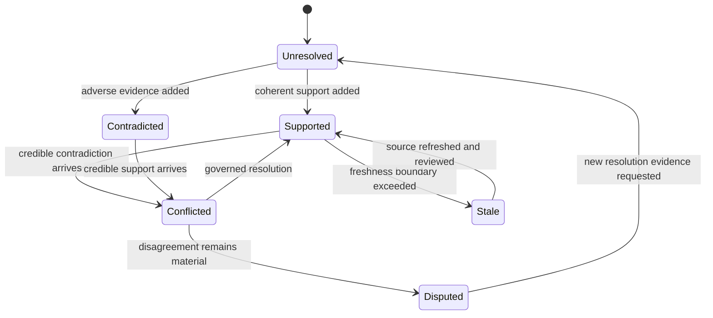

# Lifecycle Overview

Knowledge evolves by appending and reconciling evidence, not by replacing inconvenient history. Claims can gain support, become disputed, go stale, remain insufficient, or be split by context as new records arrive.

## Evidence lifecycle

Ingestion records origin—observed, inferred, imported, or synthetic—and extraction method—manual curation, automated import, model inference, or lab capture. Quantitative support retains intervals, variance, replicate and peptide counts, localization probability, censoring, scale, and units. Artifact flags keep missing-not-at-random behavior, interference, protein ambiguity, and localization uncertainty visible.

Claims link supporting and contradicting evidence separately. Their status, evidence state, confidence, assumptions, decision impact, and proposed resolution assays can change while source records remain intact. Decision lineage connects later use back to both favorable and disputed claims.

## Conflict lifecycle

Reconciliation evaluates source precedence, confidence difference, severity, context, and modality under a named policy. Possible actions include accepting higher-trust evidence, requiring curation, holding a decision, or splitting by context or modality. Each resolution records rationale, actor, time, and its effect on claim belief.

A resolved conflict is not deleted. It remains available for audit and can be revisited when a source is corrected, a reference release changes, or new evidence alters the balance.
