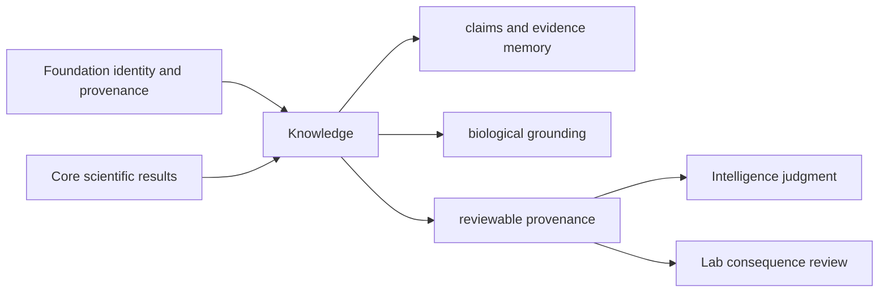

# Ownership Boundary

Knowledge owns the durable meaning and custody of claims, evidence, references,
biological identity, and their relationships. It answers “what is asserted,
what supports it, where did that support come from, and what remains uncertain
or contradictory?” It does not decide what action to take.

## Owned Meanings

| Surface | Owned responsibility | Representative implementation |
| --- | --- | --- |
| claims and evidence | typed assertion, support, provenance, uncertainty | `memory/models/claims.py`, `memory/models/evidence.py` |
| graph integrity | valid claim/evidence relationships and reachable records | `memory/integrity/graph.py` |
| ingestion and reconciliation | normalized custody and explicit conflict resolution | `memory/normalization/ingestion.py`, `memory/reconciliation/resolution.py` |
| identity and biological context | protein, pathway, complex, disease, drug, kinase, ortholog, and feature grounding | domain packages under `identity/`, `pathways/`, `complexes/`, `disease/`, `drugs/`, `kinases/`, `orthologs/`, `features/` |
| reference evidence | public source registry, citation context, comparator evidence | `references/` |
| review handoff | provenance, evidence coverage, explanation, decision brief input | `reviews/` and `coverage/` |

## Refused Ownership

| Concern | Canonical owner | Knowledge records instead |
| --- | --- | --- |
| shared identifier and provenance primitives | Foundation | references to stable primitives |
| parsing, normalization algorithms, statistical inference | Core | resulting evidence with method provenance |
| ranking, confidence policy, recommendation, refusal | Intelligence | evidence packet and uncertainty |
| run orchestration, retries, replay, artifact emission | Runtime | run and artifact references |
| intervention feasibility and observed outcome | Lab | consequence and outcome evidence after handoff |

Knowledge may say that evidence is missing, conflicting, stale, or insufficient.
It must not convert those findings into a recommendation posture or laboratory
instruction.

## Boundary Review

Keep a change here when it preserves or resolves scientific memory and the
result can be reviewed independently of a decision policy. Move it when the
change calculates a scientific result, schedules work, ranks options, or
records an intervention outcome.

The decisive proof is a reconstructable chain from claim to evidence to source,
including ambiguity and contradiction—not merely a serialized record.
