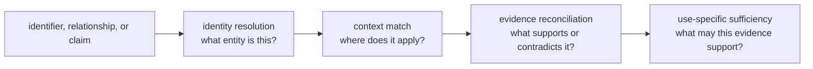
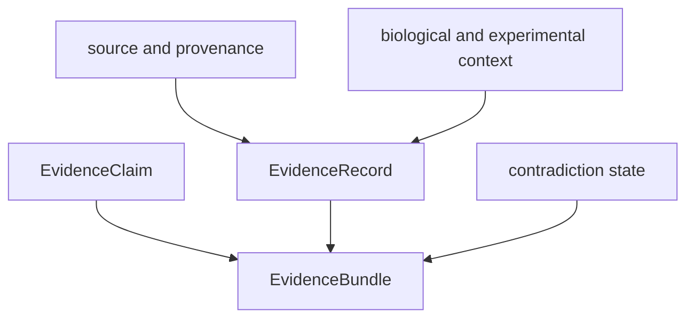

# Scientific knowledge map

The knowledge package combines durable evidence memory with typed biological
resolution. Its modules answer where an assertion came from, which context it
applies to, what contradicts it, and which biological entities can be linked
without exceeding the available evidence.

## Four Questions That Must Stay Separate



An exact identifier match does not establish a relationship. A curated
relationship does not establish activity in the observed context. Supporting
evidence does not establish sufficiency for every claim. Keeping these verdicts
separate is the central knowledge contract.

## Evidence memory

`memory.models` defines claims and evidence records. `memory.normalization`
ingests external records into stable forms, `memory.reconciliation` resolves
duplicate or conflicting representations, and `memory.integrity` checks graph
relationships. Evidence bundles preserve source-level detail while providing a
portable handoff for review.



## Reference grounding

`references.grounding` owns citations, contexts, literature, ontologies,
curated corpora, rules, and known grounding problems. `references.workflows`
builds review-level products: claim grounding, benchmark ledgers, comparator
confrontations, literature audits and matrices, contradiction dossiers,
evidence sufficiency, knowledge deficits, reading packs, replay proof, and
scientific-release risk.

Grounding rules are context-sensitive. A source that supports a protein-level
statement may not support a site-specific PTM claim; evidence from one species,
tissue, assay, or perturbation cannot be transferred without an explicit rule
and uncertainty record.

## Biological resolution families

| Module | Resolution responsibility |
| --- | --- |
| `identity` | canonical protein identity and unresolved/ambiguous status |
| `features` | overlap between protein intervals and governed feature types |
| `pathways` | pathway membership and coverage confidence |
| `complexes` | complex membership with confidence and coverage policy |
| `kinases` | kinase–substrate match type and resolution evidence |
| `drugs` | drug–target relationship type and resolution |
| `disease` | disease-term normalization and resolution |
| `orthologs` | cross-species mapping and explicit ambiguity |
| `coverage` | completeness by entity set and knowledge type |

These modules return typed entries, summaries, and reports. TSV renderers are
provided for review and interoperability, but the rendered table is a view of
the typed result rather than a second source of truth.

## Review handoff

`reviews` turns evidence memory into provenance reports, explanations, trends,
flagship evidence summaries, and `KnowledgeDecisionBrief` objects. A brief
communicates current evidence posture to intelligence or lab; it does not
discard the underlying sources, open contradictions, or coverage gaps.

## Choose The Evidence Surface

| Reader question | Owning surface | Required review evidence |
| --- | --- | --- |
| Which biological entity does this value denote? | `identity`, `orthologs` | normalized input, exact/alias/ambiguous/unresolved status, candidate mappings |
| Does a curated relationship exist? | `features`, `pathways`, `complexes`, `kinases`, `drugs`, `disease` | source, relationship type, coverage, match policy, unresolved members |
| Which records bear on this claim? | `memory`, reference grounding | supporting and contradicting records with source and experimental context |
| Can conflicting records be reconciled? | reconciliation and contradiction workflows | grouping rule, retained disagreements, resolution account, remaining conflict |
| Is evidence sufficient for this use? | sufficiency, deficit, and scientific-risk workflows | requested claim, threshold policy, coverage gaps, stale or missing sources |
| What can another package consume? | `reviews` | decision brief linked to the complete evidence bundle and provenance report |

## Public API example

```python
from bijux_proteomics_knowledge import (
    EvidenceBundle,
    KnowledgeCoveragePolicy,
    compute_knowledge_coverage,
    resolve_protein_ids,
)
```

This package has no standalone CLI or HTTP service. Consuming applications may
render its reports or expose them through runtime while retaining the package's
schema and provenance contracts.

## Scientific limits

Resolution is bounded by source freshness, identifier coverage, context
specificity, licensing, curation quality, and contradiction state. A successful
lookup is not proof of completeness, and a normalized relationship is not
automatically causal. Knowledge returns uncertainty and gaps so downstream
decision policy can narrow or refuse a recommendation.

Knowledge review is complete only when identity status, source context,
support, contradiction, freshness, coverage, and use-specific sufficiency are
visible together. A lookup count or aggregate confidence cannot substitute for
that record.
