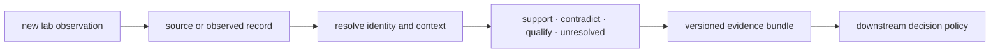

# Repository fit

Knowledge owns the difference between possessing a source and being justified
in using it for a claim. It gives evidence a durable identity, context,
relationship, lineage, contradiction state, and use-specific sufficiency
assessment before any ranking or laboratory action consumes it.

## Why a separate package exists

Core can establish what a scientific calculation produced, but not whether the
literature and reference context support a later biological claim. Intelligence
can choose among actions, but must not curate the evidence that makes one action
look preferable. Lab can produce an observation, but must not decide its
relationship to every prior claim while recording the measurement.

Keeping evidence custody separate prevents all three from rewriting their own
inputs.

## Owned surfaces

| Surface | Knowledge responsibility |
| --- | --- |
| `identity` and biological resolvers | connect source identifiers to declared proteins and contexts without hiding ambiguity |
| `memory` | append evidence and claims, preserve lineage, and reconcile duplicates or conflicts |
| `references` | record literature, ontology, corpus, comparator, citation, and release-facing evidence context |
| `coverage` | expose what the current evidence can and cannot address |
| protein features, pathways, complexes, kinases, diseases, drugs, and orthologs | produce typed, contextual resolution reports |
| `reviews` | assemble bounded scientific briefs without replacing canonical evidence records |

## Placement test

| Question answered by the proposed behavior | Owner |
| --- | --- |
| what did the scientific calculation report? | Core |
| which source says what, in which context, and with what relationship? | Knowledge |
| which action is preferred under declared values and constraints? | Intelligence |
| what executed and which artifacts were produced? | Runtime |
| what was planned, measured, accepted, or found inconclusive? | Lab |

The same code path may touch several answers. Preserve them as linked records
rather than inventing one aggregate “confidence” value with no identifiable
owner.

## What does not fit

- unversioned text snippets whose source and retrieval identity cannot be
  reconstructed;
- generic context storage with no claim, relationship, or intended-use model;
- ranking weights, portfolio objectives, or recommendation thresholds;
- runtime transport, provider selection, retry, or cache behavior;
- laboratory scheduling and execution authority;
- a conflict resolver that discards disagreement to produce a convenient
  single answer.

## Fit tests

Knowledge remains coherent when every review conclusion can be reopened into
its source records, context, relationship, reconciliation rule, and unresolved
gaps. A changed conclusion creates a new bundle linked to its predecessor. It
never edits history to make the current position appear inevitable.

For the record model, use [claim anatomy](../index.md#claim-anatomy) and
[memory integrity](../index.md#memory-integrity). For use-specific evidence
burden, continue with [evidence sufficiency](../index.md#evidence-sufficiency-is-use-specific).
