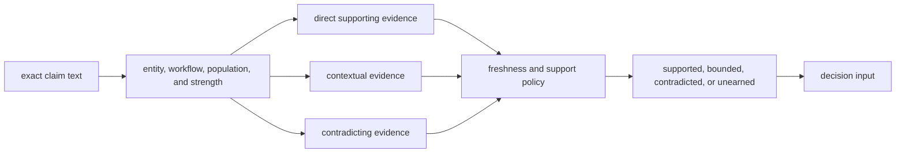

# Workflow Claim Grounding

Workflow claim grounding identifies which public scientific sentences are
supported by named evidence and which remain bounded, contradicted, or
unearned.

`bijux-proteomics-knowledge` preserves the connection between an exact claim,
its evidence revision, source lineage, contradiction state, and support
policy. It does not infer support from cautious wording.

## What Ships

The grounding surface is built around three workflow-family artifacts:

- a claim citation table for sentences with direct named support
- an unsupported-claim ledger for sentences that still overrun the current
  evidence
- a contradiction triage report for sentences that are supported and still
  scientifically narrowed

These surfaces cover claim-bearing prose in flagship trust pages and public
review packets. They intentionally do not treat every heading, link label, or
metadata field as a scientific claim.

## How To Read The Grounding Pack

- start with the claim citation table when the question is whether a sentence
  has direct support
- move to the unsupported-claim ledger when the sentence sounds smoother than
  the actual proof
- move to contradiction triage when the sentence is partly supported and still
  scientifically narrowed by conflict or thin transfer

The result is one explicit state: supported, bounded, contradicted, or not
earned.

## Ground One Claim

Direct support must entail the scoped sentence at the stated strength.
Contextual evidence can explain plausibility or mechanism but cannot substitute
for direct support. Contradiction remains attached even when supporting
evidence exists; support and conflict are not mutually exclusive tallies.

| grounding field | required question |
| --- | --- |
| exact claim | What proposition would be false if the claim failed? |
| scope | Which entity, workflow, population, comparator, and confidence are asserted? |
| support | Which named source directly supports that proposition? |
| contradiction | Which named source or checked result narrows it? |
| freshness | Was the evidence valid under the recorded review policy? |
| state | Which policy rule produced the grounding state? |

## Workflow Coverage

| family | grounding surface role today | likely reason a sentence still narrows |
| --- | --- | --- |
| `dda` | strong scientific support for bounded language | runtime evidence lowers the end-to-end public posture below the strongest grounding request |
| `dia` | strong support for bounded outsider language | library incompleteness and downstream consequence still narrow broader wording |
| `lfq` | direct support for bounded outsider-auditable language | missingness, normalization, and transfer pressure still block stronger wording |
| `ptm` | strong support for localization and bounded trust language | consequence confidence remains weaker than localization evidence |
| `targeted` | strong support for bounded outsider language | calibration, interference, and follow-up burden still narrow broader certainty |
| `multiplex` | support for internal-support-only language | the current stress packet still defeats outsider trust |

## Decisions Grounding Does Not Make

- final recommendation posture by itself
- downstream assay worth by itself
- runtime realism by itself

Grounding answers whether the sentence is scientifically supported. The next
layers decide whether it still deserves to sound that strong after judgment and
consequence pressure are included.

## Continue From Grounding

- Open [Workflow Recommendation Confidence](https://bijux.io/bijux-proteomics/05-bijux-proteomics-intelligence/foundation/workflow-recommendation-confidence/)
  when the question becomes whether supported wording is still too confident.
- Open [Lab Consequence](https://bijux.io/bijux-proteomics/07-bijux-proteomics-lab/foundation/lab-consequence/)
  when the question becomes whether the follow-up burden still narrows the
  supported sentence.
- Open [Decision Support](https://bijux.io/bijux-proteomics/01-bijux-proteomics/foundation/decision-support/)
  when the reader needs the full route from support to judgment to consequence.

## Boundary

Grounding settles scientific sentence support. It does not settle
recommendation strength, runtime realism, or laboratory meaning.
